# upc-pre-202401-si729-sv55-DevDinasty-report-tb1

Universidad Peruana de Ciencias Aplicadas

Carrera: Ingeniería de Software

Ciclo: 2024-01

Curso: Desarrollo de Aplicaciones Open Source

Sección: SV55

Profesor: Alberto Wilmer Sanchez Seña

Informe del Trabajo Final

Startup: DevDinasty

Producto: SkillSwap

Integrantes:

- Cuellar Villegas, Fabrizio Daniel
- Huachaca Advincula, Scott Jacobo
- Ramos Calagua, Sebastian Alexander

Junio del 2024

---

# Registro de Versiones del Informe

| VERSIÓN  | FECHA           | AUTOR                                                                                                 | DESCRIPCIÓN DE MODIFICACIÓN                                                                                                                                                                                                                                                                                                                                                      |
|----------|-----------------|-------------------------------------------------------------------------------------------------------|----------------------------------------------------------------------------------------------------------------------------------------------------------------------------------------------------------------------------------------------------------------------------------------------------------------------------------------------------------------------------------|
| TB1      | 11/04/2024      | *Cuellar Villegas Fabrizio Daniel *Scott Jacobo Huachaca Advincula *Ramos Calagua Sebastián Alexander | Se realizaron el  *Capítulo I: Introducción  *Capítulo II: Requirements Elicitation & Analysis.  *Capítulo III: Requirements Specification.  *Capítulo IV: Product Design.   *Capítulo V: Product Implementation, Validation & Deployment.                                                                                                                   |
| TP1      | 30/04/2024      | *Cuellar Villegas Fabrizio Daniel *Scott Jacobo Huachaca Advincula *Ramos Calagua Sebastián Alexander | Se realizaron el  *Capítulo V:  Sprint 2:  -  Sprint Planning 2.  -  Sprint Backlog 2.  -  Development Evidence for Sprint Review.  -  Testing Suite Evidence for Sprint Review.  -  Execution Evidence for Sprint Review.  -  Services Documentation.  - Evidence for Sprint Review.  - Software Deployment Evidence for Sprint Review. |
| TB2      | 06/06/2024      | *Cuellar Villegas Fabrizio Daniel *Scott Jacobo Huachaca Advincula *Ramos Calagua Sebastián Alexander | Se realizaron el  *Capítulo V: Sprint 3:  -  Sprint Planning 3.  -  Sprint Backlog 3.  -  Development Evidence for Sprint Review.  -  Testing Suite Evidence for Sprint Review.  -  Execution Evidence for Sprint Review.  -  Services Documentation  - Evidence for Sprint Review.  - Software Deployment Evidence for Sprint Review.       |

# Project Report Collaboration Insights

---

# Student Outcome

A manera de referencia se incluye los criterios o aspectos específicos que ABET – EAC - Student Outcome 3. La capacidad de comunicarse efectivamente con un rango de audiencias.

| CRITERIO ESPECÍFICO                                                                                                                                                                   | ACCIONES REALIZADAS                                                                                                                                                                                                                                                                                                                                                                                                                                                                                                                                                                                                                                                                                                                                                                                                                                                                                                                                                                                                                                                                                                                                                                                                                                                                                                                                                                                                                                                                                                                                                                                                                                                                                                                                                                                                                                                                                                                                                                    | CONCLUSIONES                                                                                                                                                                                                                                                                                                                                                                                                                                                                                                                                                                                                                                                                                                                                                                                                                                                                                                                                                                                                                                                                                                                                                                                                                                                                                                                                                                                                                                                                                                                                                                                                                                                                                                                                                                                                                                                                                                                                                                                                                                                                                                                         |                                                                                                                                                                                                                                                                                                                                                
|---------------------------------------------------------------------------------------------------------------------------------------------------------------------------------------|----------------------------------------------------------------------------------------------------------------------------------------------------------------------------------------------------------------------------------------------------------------------------------------------------------------------------------------------------------------------------------------------------------------------------------------------------------------------------------------------------------------------------------------------------------------------------------------------------------------------------------------------------------------------------------------------------------------------------------------------------------------------------------------------------------------------------------------------------------------------------------------------------------------------------------------------------------------------------------------------------------------------------------------------------------------------------------------------------------------------------------------------------------------------------------------------------------------------------------------------------------------------------------------------------------------------------------------------------------------------------------------------------------------------------------------------------------------------------------------------------------------------------------------------------------------------------------------------------------------------------------------------------------------------------------------------------------------------------------------------------------------------------------------------------------------------------------------------------------------------------------------------------------------------------------------------------------------------------------------|--------------------------------------------------------------------------------------------------------------------------------------------------------------------------------------------------------------------------------------------------------------------------------------------------------------------------------------------------------------------------------------------------------------------------------------------------------------------------------------------------------------------------------------------------------------------------------------------------------------------------------------------------------------------------------------------------------------------------------------------------------------------------------------------------------------------------------------------------------------------------------------------------------------------------------------------------------------------------------------------------------------------------------------------------------------------------------------------------------------------------------------------------------------------------------------------------------------------------------------------------------------------------------------------------------------------------------------------------------------------------------------------------------------------------------------------------------------------------------------------------------------------------------------------------------------------------------------------------------------------------------------------------------------------------------------------------------------------------------------------------------------------------------------------------------------------------------------------------------------------------------------------------------------------------------------------------------------------------------------------------------------------------------------------------------------------------------------------------------------------------------------|
| Comunica oralmente sus ideas y/o resultados con objetividad a público de diferentes especialidades y niveles jerárquicos, en el marco del desarrollo de un proyecto en ingeniería.    | TB1  *Cuellar Villegas Fabrizio Daniel:  - Para esta entrega realicé los user stories, style guidelines e information architecture.  *Scott Jacobo Huachaca Advincula:  - Para la entrega ayudé haciendo las entrevistas con sus registros y análisis.  *Ramos Calagua Sebastián Alexander:  - Para esta entrega elaboré el To-be escenario mapping , impact mapping , product backlog , con la finalidad de ayudar al equipo a realizar el trabajo correspondiente.   TP1  *Cuellar Villegas Fabrizio Daniel:  -Transmití la versión inicial de la aplicación mediante un video. Se expusieron las principales funcionalidades y principales componentes de la aplicación front-end.  *Scott Jacobo Huachaca Advincula:  - Avances como la paleta de colores y la tipografía de la aplicación fueron expuestos.  *Ramos Calagua Sebastián Alexander:  - Para la entrega ayudé con la corrección de los defectos de la versión pasada y ayudando en el diseño.   TB2  *Cuellar Villegas Fabrizio Daniel: -Transmití de forma oral la versión inicial de la aplicación frontend mediante un video.  *Scott Jacobo Huachaca Advincula:  - Transmití de forma oral la versión oficial del backend de nuestra aplicación mediante un video.  *Ramos Calagua Sebastián Alexander:  - Se expusieron las principales funcionalidades y principales componentes de la aplicación front-end y back-end.   TF1  *Cuellar Villegas Fabrizio Daniel:  - Se realizó la validación del diseño de la solución de software considerando aspectos en seguridad, bienestar.  *Scott Jacobo Huachaca Advincula:  - Se realizó la validación del diseño de la solución de software considerando aspectos en bienestar.  *Ramos Calagua Sebastián Alexander:  - Se realizó la validación del diseño de la solución de software considerando factores tales como sociales y económicos.  | TB1  *Cuellar Villegas Fabrizio Daniel:  - Concluyo que un buen desenvolvimiento oral, tomando en cuenta todas las masas de público es fundamental si se quiere comunicar ideas que lleguen a la mente de todo tipo de personas.  *Scott Jacobo Huachaca Advincula:  - El equipo desarrolló todos los puntos que nos pidió la rúbrica para esta entrega.  *Ramos Calagua Sebastián Alexander:  - Se rescata la importancia de organización en el equipo con el fin de realizar los trabajos de manera eficiente.   TP1  *Cuellar Villegas Fabrizio Daniel:  - Una buena redacción en temas técnicos es una clave fundamental para transmitir lo que se desea comunicar resultados con certeza al público  *Scott Jacobo Huachaca Advincula:  - Escribir bien sobre temas técnicos es fundamental para transmitir su mensaje a su audiencia con el máximo impacto.  *Ramos Calagua Sebastián Alexander:  - Tener un buen Needfinding nos ayuda a tener un mejor enfoque de nuestro público y como llegar a ellos.   TB2  *Cuellar Villegas Fabrizio Daniel:  -Desenvolverse con labia ya aplomo en un video de exposición es importante debido a que transmites conocimientos además que una energía que impulsa a los demás a seguir aprendiendo.  *Scott Jacobo Huachaca Advincula:  - Con el desarrollo del Style Guidelines logramos tener una maqueta de estilos y colores que debemos usar para la creación de la app y web.  *Ramos Calagua Sebastián Alexander:  - Ser flexible y tranquilo en tu presentación en video es importante porque transmite conocimiento y energía que anima a otros.   TF1  *Cuellar Villegas Fabrizio Daniel:  - Establecimos todo un espacio para trabajar con las versiones que tendrá nuestro proyecto.  *Scott Jacobo Huachaca Advincula:  - Documentamos nuestros avances de Landing Page en un repositorio de GitHub.  *Ramos Calagua Sebastián Alexander:  - Llevamos a cabo el segundo Sprint, concluyendo así con los pendientes que contenía el primer Sprint. |
| Comunica en forma escrita ideas y/o resultados con objetividad a público de diferentes especialidades y niveles jerárquicos, en el marco del desarrollo de un proyecto en ingeniería. | TB1  *Cuellar Villegas Fabrizio Daniel:  - Logramos trabajar muy bien con la técnica de las 5 ‘W’s y 2 ‘H’s.  *Scott Jacobo Huachaca Advincula:  - Definimos los modelos y técnicas que empleamos en dos segmentos objetivos específicos.  *Ramos Calagua Sebastián Alexander:  - Expusimos mediante el informe del proyecto para así trabajar adecuadamente con cada aspecto distinto que tendrá nuestro software.   TP1  *Cuellar Villegas Fabrizio Daniel:  -Transmití la versión inicial de la aplicación mediante un video. Se expusieron las principales funcionalidades y principales componentes de la aplicación front-end.  *Scott Jacobo Huachaca Advincula:  - Avances como la paleta de colores y la tipografía de la aplicación fueron expuestos.  *Ramos Calagua Sebastián Alexander:  - Para la entrega ayudé con la corrección de los defectos de la versión pasada y ayudando en el diseño.   TB2  *Cuellar Villegas Fabrizio Daniel:  - Expusimos mediante el informe del proyecto.  *Scott Jacobo Huachaca Advincula:  - Expusimos los nuevos resultados de nuestro sprint.  *Ramos Calagua Sebastián Alexander:  - Expusimos las tareas asignadas a cada uno de nuestros miembros de trabajo.   TF1  *Cuellar Villegas Fabrizio Daniel:  - Se realizó la validación de que el diseño de la solución de software considere aspectos en seguridad, bienestar.  *Scott Jacobo Huachaca Advincula:  - Se realizó la validación del diseño de la solución de software considerando aspectos en bienestar.  *Ramos Calagua Sebastián Alexander:  - Se realizó la validación que el diseño de la solución de software considere factores tales como sociales y económicos.                                                                                                                                                                       | TB1  *Cuellar Villegas Fabrizio Daniel:  - Expusimos mediante el informe del proyecto, los principales lineamientos y bases de nuestra aplicación que nos servirán a futuro para poder desarrollar nuestra aplicación de manera uniforme.  *Scott Jacobo Huachaca Advincula:  - Logramos trabajar muy bien empleando el modelo de Lean UX.  *Ramos Calagua Sebastián Alexander:  - Logramos trabajar muy bien basándonos en la misión y visión que deseamos trabajar como grupo.    TP1  *Cuellar Villegas Fabrizio Daniel:  - Validamos esta información mediante entrevistas realizadas a distintas personas.  *Scott Jacobo Huachaca Advincula:  - Se realizaron entrevistas de nuestros dos segmentos objetivos.  *Ramos Calagua Sebastián Alexander:  - Nos basamos en estas entrevistas para realizar los modelos anteriormente mencionados.    TB2  *Cuellar Villegas Fabrizio Daniel:  - Desenvolverse con labia en un video de exposición es importante debido a que transmiten conocimientos.  *Scott Jacobo Huachaca Advincula:  - Además de que es una energía que impulsa a los demás a seguir aprendiendo.  *Ramos Calagua Sebastián Alexander:  - Finalizamos todas las funcionalidades de nuestro proyecto.    TF1  *Cuellar Villegas Fabrizio Daniel:  -Una buena redacción ayuda a comunicar a públicos que no están tan sumergidos en el tema de la tecnología como nosotros, por eso es importante contar con un vocabulario rico y extenso.  *Scott Jacobo Huachaca Advincula:  - Finalizamos todas las funcionalidades de nuestro proyecto.  *Ramos Calagua Sebastián Alexander:  - Actualizamos nuestro repositorio con los avances y pendientes que tuvimos en nuestro Spring Backlog.                                                                                                                                                                                                                                                                                               |

# Contenido

## Tabla de contenidos

### [Capítulo I: Introducción]()

- [1.1. Startup Profile]()
    - [1.1.1 Descripción de la Startup]()
    - [1.1.2 Perfiles de integrantes del equipo]()
- [1.2 Solution Profile]()
    - [1.2.1 Antecedentes y problemática]()
    - [1.2.2 Lean UX Process]()
        - [1.2.2.1. Lean UX Problem Statements]()
        - [1.2.2.2. Lean UX Assumptions]()
        - [1.2.2.3. Lean UX Hypothesis Statements]()
        - [1.2.2.4. Lean UX Canvas]()
- [1.3. Segmentos objetivo]()

### [Capítulo II: Requirements Elicitation & Analysis]()

- [2.1. Competidores]()
    - [2.1.1. Análisis competitivo]()
    - [2.1.2. Estrategias y tácticas frente a competidores]()
- [2.2. Entrevistas]()
    - [2.2.1. Diseño de entrevistas]()
    - [2.2.2. Registro de entrevistas]()
    - [2.2.3. Análisis de entrevistas]()
- [2.3. Needfinding]()
    - [2.3.1. User Personas]()
    - [2.3.2. User Task Matrix]()
    - [2.3.3. User Journey Mapping]()
    - [2.3.4. Empathy Mapping]()
    - [2.3.5. As-is Scenario Mapping]()
- [2.4. Ubiquitous Language]()

### [Capítulo III: Requirements Specification]()

- [3.1. To-Be Scenario Mapping]()
- [3.2. User Stories]()
- [3.3. Impact Mapping]()
- [3.4. Product Backlog]()

### [Capítulo IV: Product Design]()

- [4.1. Style Guidelines]()
    - [4.1.1. General Style Guidelines]()
    - [4.1.2. Web Style Guidelines]()
- [4.2. Information Architecture]()
    - [4.2.1. Organization Systems]()
    - [4.2.2. Labeling Systems]()
    - [4.2.3. SEO Tags and Meta Tags]()
    - [4.2.4. Searching Systems]()
    - [4.2.5. Navigation Systems]()
- [4.3. Landing Page UI Design]()
    - [4.3.1. Landing Page Wireframe]()
    - [4.3.2. Landing Page Mock-up]()
- [4.4. Web Applications UX/UI Design]()
    - [4.4.1. Web Applications Wireframes]()
    - [4.4.2. Web Applications Wireflow Diagrams]()
    - [4.4.3. Web Applications Mock-ups]()
    - [4.4.4. Web Applications User Flow Diagrams]()
- [4.5. Web Applications Prototyping]()
- [4.6. Domain-Driven Software Architecture]()
    - [4.6.1. Software Architecture Context Diagram]()
    - [4.6.2. Software Architecture Container Diagrams]()
    - [4.6.3. Software Architecture Components Diagrams]()
- [4.7. Software Object-Oriented Design]()
    - [4.7.1. Class Diagrams]()
    - [4.7.2. Class Dictionary]()
- [4.8. Database Design]()
    - [4.8.1. Database Diagram]()

### [Capítulo V: Product Implementation, Validation & Deployment]()

- [5.1. Software Configuration Management]()
    - [5.1.1. Software Development Environment Configuration]()
    - [5.1.2. Source Code Management]()
    - [5.1.3. Source Code Style Guide & Conventions]()
    - [5.1.4. Software Deployment Configuration]()
- [5.2. Landing Page, Services & Applications Implementation]()
    - [5.2.1. Sprint 1]()
        - [5.2.1.1. Sprint Planning 1]()
        - [5.2.1.2. Sprint Backlog 1]()
        - [5.2.1.3. Development Evidence for Sprint Review]()
        - [5.2.1.4. Testing Suite Evidence for Sprint Review]()
        - [5.2.1.5. Execution Evidence for Sprint Review]()
        - [5.2.1.6. Services Documentation Evidence for Sprint Review]()
        - [5.2.1.7. Software Deployment Evidence for Sprint Review]()
        - [5.2.1.8. Team Collaboration Insights during Sprint]()
    - [5.2.2. Sprint 2]()
        - [5.2.2.1. Sprint Planning 2]()
        - [5.2.2.2. Sprint Backlog 2]()
        - [5.2.2.3. Development Evidence for Sprint Review]()
        - [5.2.2.4. Testing Suite Evidence for Sprint Review]()
        - [5.2.2.5. Execution Evidence for Sprint Review]()
        - [5.2.2.6. Services Documentation Evidence for Sprint Review]()
        - [5.2.2.7. Software Deployment Evidence for Sprint Review]()
        - [5.2.2.8. Team Collaboration Insights during Sprint]()
    - [5.2.3. Sprint 3]()
        - [5.2.3.1. Sprint Planning 3]()
        - [5.2.3.2. Sprint Backlog 3]()
        - [5.2.3.3. Development Evidence for Sprint Review]()
        - [5.2.3.4. Testing Suite Evidence for Sprint Review]()
        - [5.2.3.5. Execution Evidence for Sprint Review]()
        - [5.2.3.6. Services Documentation Evidence for Sprint Review]()
        - [5.2.3.7. Software Deployment Evidence for Sprint Review]()
        - [5.2.3.8. Team Collaboration Insights during Sprint]()
    - [5.2.4. Sprint 4]()
        - [5.2.4.1. Sprint Planning 4]()
        - [5.2.4.2. Sprint Backlog 4]()
        - [5.2.4.3. Development Evidence for Sprint Review]()
        - [5.2.4.4. Testing Suite Evidence for Sprint Review]()
        - [5.2.4.5. Execution Evidence for Sprint Review]()
        - [5.2.4.6. Services Documentation Evidence for Sprint Review]()
        - [5.2.4.7. Software Deployment Evidence for Sprint Review]()
        - [5.2.4.8. Team Collaboration Insights during Sprint]()
- [5.3. Validation Interviews]()
    - [5.3.1. Diseño de Entrevistas]()
    - [5.3.2. Registro de Entrevistas]()
    - [5.3.3. Evaluaciones según heurísticas]()
- [5.4. Video About-the-Product]()

---

# Capítulo I: Introducción

## 1.1. Startup Profile

### 1.1.1 Descripción de la Startup

### 1.1.2 Perfiles de integrantes del equipo

Nombre completo: Fabrizio Cuellar Villegas

Código de estudiante: U20201c773

Carrera: Ingeniería de Software

Acerca de mí: Mi nombre es Fabrizio Daniel Cuellar Villegas. Estudio la carrera de Ingeniería de software y actualmente
me encuentro en el 7mo ciclo. Soy muy responsable, y comunicador para crear lazos entre los integrantes de un equipo.
Cuento con conocimientos en programación en distintos lenguajes como C++, C#, JavaScript.

Nombre completo: Scott Jacobo Huachaca Advincula

Código de estudiante: U201914294

Carrera: Ingeniería de Software

Acerca de mí: Soy estudiante de la UPC, la razon por la que elegi la carrera es porque combina las cosas que me gustan
como la tecnologia y la creacion de aplicaciones. Ademas siempre me ha intrigado como funcionan las aplicaciones que
utilizamos a diario, como las redes sociales o aplicaciones de productividad.

Nombre completo: Ramos Calagua Sebastián Alexander

Código de estudiante: U202222846

Carrera: Ingeniería de Software

Acerca de mí: Estudiante de la carrera de Ingeniería de Software. Me gusta todo lo relacionado a la tecnología y al
desarrollo web. Espero ansioso poder aprender más del curso a medida que se desarrolle este proyecto.

## 1.2 Solution Profile

| 5W - 2H     |                                                                                                                                                                                                                                                                        |
|-------------|------------------------------------------------------------------------------------------------------------------------------------------------------------------------------------------------------------------------------------------------------------------------|
| What?       | Se ha identificado el problema de la poca retroalimentación y comunicación en plataformas de cursos en línea. Aún existe gran parte de usuarios tutores que no resuelven dudas ni ayudan a los usuarios que intentan aprender en línea.                                |                                                                                                                                                                                                                                |
| When?       | Esta situación ocurre cuando usuarios entusiasmados pagan por cursos en línea y terminan con más dudas y confusiones que conocimientos consolidados.                                                                                                                   |
| Where?      | Este problema se ha identificado en plataformas de cursos en línea como Coursera, Platzi y Udemy                                                                                                                                                                       |                                                                                                                                                                                                                                |
| Who?        | Los afectados ante esta problemática son los usuarios aprendices.                                                                                                                                                                                                      |
| Why?        | Este problema se da debido a que la educación en línea suele tener un poco más de barreras en la comunicación de tutores a alumnos.                                                                                                                                    |                                                                                                                                                                                                                                |
| How?        | Los usuarios al consumir material de los cursos a los que se inscribieron reciben mucha información que los deja con muchas preguntas. Es importante resolver estas preguntas lo antes posible para una mejor curva de aprendizaje                                     |
| How much?   | Este problema se da en múltiples oportunidades de manera diaria en plataformas de cursos en línea como Platzi, Udemy, Coursera, etc. Miles de personas acuden a estas plataformas para aprender de manera íntegra y esperan llevar un correcto proceso de aprendizaje. |

### 1.2.1 Antecedentes y problemática

### 1.2.2 Lean UX Process
#### 1.2.2.1. Lean UX Problem Statements

Nuestra aplicación brinda a usuarios aprendices inexpertos cursos en línea garantizándoles una buena comunicación con los usuarios tutores que imparten los cursos. De esta manera, se asegura la resolución de posibles dudas y preguntas que surjan por parte de los usuarios inexpertos.

Existe el problema de que los usuarios aprendices buscan que sus dudas o preguntas sean respondidas o clarificadas lo más rápido posible, y que mejor que sean respondidas por el tutor experto del tema. Sin embargo, esto no sucede en la mayoría de casos en los que vemos una falta de comunicación íntegra entre los aprendices de los cursos y los tutores.

#### 1.2.2.2. Lean UX Assumptions

-   Nuestros usuarios buscan una aplicación de cursos en línea en la cual prime la comunicación entre los tutores y aprendices. Asimismo, buscan que sus preguntas sean respondidas de manera asertiva y en el menor tiempo posible para asegurar así una mejor curva de aprendizaje. Los usuarios tutores, por su parte, buscan ser reconocidos por su labor de no solo compartir sus conocimientos con los demás, si no de también preocuparse por el aprendizaje de sus alumnos.
-   Tenemos 2 públicos objetivos: Los usuarios aprendices, que buscan adquirir conocimientos sobre ciertas materias. Asimismo, buscan que sus dudas y/o consultas sean respondidas en la mayor brevedad posible. Por otra parte, tenemos a los usuarios tutores, que si bien buscan compartir sus conocimientos con otros usuarios de la aplicación, también cuentan con la posibilidad de expandir sus conocimientos mediante los cursos de nuestra plataforma.
-   La solución brindada busca mejorar la experiencia del usuario aprendiz garantizando una mejor comunicación con el tutor, sintiéndose así más seguro en su proceso de adquisición de conocimientos nuevos. La solución también ayuda a mejorar la experiencia de los usuarios profesores o tutores, dándoles reconocimiento en su labor no solo de compartir sus conocimientos, sino también de estar comprometidos con la educación de sus alumnos en plataformas en línea.

Business Outcomes

- Garantiza la expansión de conocimientos previos de usuarios tutores de nuestra aplicación
- Mejora la experiencia del usuario aprendiz al garantizar que sus dudas o preguntas serán resueltas por expertos de las materias.
- Aumenta la confiabilidad del trabajo de usuarios tutores, adquiriendo mayor cantidad de usuarios fieles a lo largo del tiempo.

Users 	
- Usuario aprendiz: Persona que solamente busca adquirir conocimientos en materias específicas y espera que sus dudas sean resueltas.
- Usuario tutor: Personas expertas sobre algún tema que buscan compartir sus conocimientos con los demás. También buscan expandir sus conocimientos.

User Outcomes
- Los usuarios se sentirán familiarizados con el flujo de uso de la aplicación debido a que es una aplicación intuitiva y con un fácil entendimiento de su uso.
- Los usuarios tutores ampliarán sus conocimientos previos de materias y no solo se limitarán a enseñar, si así lo desean.

Features 	
- Función que permite publicar un nuevo curso en línea.
- Función que permite acceder a un chat privado con el tutor de un curso
- Función que permite dejar preguntas acerca de un material en específico de un curso
- Función que permite dejar rating acerca de tutores y cursos en línea

#### 1.2.2.3. Lean UX Hypothesis Statements
    
Hypothesis: (1)

Creemos que

Al brindar una aplicación de cursos en línea con un preciado enfoque hacia la comunicación entre los tutores y aprendices, los usuarios tendrán una mejor experiencia dentro de nuestra plataforma.

Sabremos que hemos tenido éxito

Cuando se incremente la cantidad de usuarios que usan la aplicación en nuestra base de datos en un 20% después de 8 semanas.

Hypothesis: (2)

Creemos que

Al brindar una calificación de tutores con base en la comunicación con sus alumnos, se elevará la cantidad de usuarios fieles de un tutor en nuestra plataforma.

Sabremos que hemos tenido éxito

Cuando se incremente la cantidad de seguidores de los tutores de nuestra plataforma en un 15% después de 4 semanas.

Hypothesis: (3)

Creemos que

Al brindar un sistema de calificación de tutores con base en la comunicación retroalimentaria con sus alumnos, estos aumentarán sus ventas de cursos en línea.

Sabremos que hemos tenido éxito

Cuando se incremente la cantidad de ventas de cursos de tutores con buena calificación en un 20% después de 8 semanas.

#### 1.2.2.4. Lean UX Canvas
| 1. Problemas de Negocio   Nuestra aplicación brinda a nuestros usuarios aprendices un catálogo de cursos en línea, además de una comunicación activa con los tutores de dichos cursos. Existe el problema de que los usuarios aprendices buscan que las dudas o preguntas que les surgen sean resueltas durante su proceso de aprendizaje en línea. Sin embargo, esto no sucede frecuentemente en la actualidad, debido a que esto no es un foco principal para las plataformas de cursos en línea.                                                                                                                                                                                                                                                                                                                                                                                                                                                                                                                                                                                                                                                                                                                                                   | 5. Ideas de solución   · App de cursos en línea que cuentan con incentivos para los tutores que se preocupan por las dudas de sus alumnos.                                                                                                                                                                                                             | 2. Resultados Comerciales    · Garantizar un mejor proceso de aprendizaje de nuestros usuarios aprendices al brindarles mayores vías de comunicación con los tutores expertos.   · Brindar confiabilidad a los tutores mediante los rankings o clasificaciones de labor en nuestra aplicación.  · Aumentar las ventas de cursos en línea de nuestros usuarios tutores                                  |
|---------------------------------------------------------------------------------------------------------------------------------------------------------------------------------------------------------------------------------------------------------------------------------------------------------------------------------------------------------------------------------------------------------------------------------------------------------------------------------------------------------------------------------------------------------------------------------------------------------------------------------------------------------------------------------------------------------------------------------------------------------------------------------------------------------------------------------------------------------------------------------------------------------------------------------------------------------------------------------------------------------------------------------------------------------------------------------------------------------------------------------------------------------------------------------------------------------------------------------------------------------------|----------------------------------------------------------------------------------------------------------------------------------------------------------------------------------------------------------------------------------------------------------------------------------------------------------------------------------------------------------------|------------------------------------------------------------------------------------------------------------------------------------------------------------------------------------------------------------------------------------------------------------------------------------------------------------------------------------------------------------------------------------------------------------------------|
| 3. Usuarios y Clientes   · Usuario Aprendiz: Persona que busca adquirir conocimientos en línea de manera autodidacta sobre cierta materia.  · Usuario Tutor: Persona que busca impartir sus conocimientos con otros, además de seguir educándose.                                                                                                                                                                                                                                                                                                                                                                                                                                                                                                                                                                                                                                                                                                                                                                                                                                                                                                                                                                                                 |  · App de cursos en línea que soporte clases en vivo para que los tutores estén más al pendiente de las dudas o consultas de sus alumnos.                                                                                                                                                                                                                  | 4. Beneficios del usuario   · Mejorar las vías de comunicación entre los usuarios aprendices y tutores de nuestra aplicación.  · Incrementar la confiabilidad de un tutor y la fidelidad de sus seguidores de su trabajo.  · Garantizar un mejor proceso de aprendizaje mediante la pronta resolución de dudas o preguntas de los usuarios aprendices.  · Aumentar las ventas los usuarios tutores |
| 6. Hipótesis   Hypothesis: (1)   Creemos que   Al brindar una aplicación de cursos en línea con un preciado enfoque hacia la comunicación entre los tutores y aprendices, los usuarios tendrán una mejor experiencia dentro de nuestra plataforma.   Sabremos que hemos tenido éxito    Cuando se incremente la cantidad de usuarios que usan la aplicación en nuestra base de datos en un 20% después de 8 semanas.   Hypothesis: (2)   Creemos que  Al brindar una calificación de tutores en base a la comunicación con sus alumnos, se elevará la cantidad de usuarios fieles de un tutor en nuestra plataforma.   Sabremos que hemos tenido éxito   Cuando se incremente la cantidad de seguidores de los tutores de nuestra plataforma en un 15% después de 4 semanas.    Hypothesis: (3)    Creemos que    Al brindar un sistema de calificación de tutores en base a la comunicación retroalimentaria con sus alumnos, estos aumentarán sus ventas de cursos en línea.   Sabremos que hemos tenido éxito    Cuando se incremente la cantidad de ventas de cursos de tutores con buena calificación en un 20% después de 8 semanas | 7. ¿Qué es lo más importante que debemos aprender primero?   · Conocer cuáles son las limitantes de una buena comunicación entre tutores y aprendices en plataformas en línea.  · Conocer las razones por las cuales los usuarios aprendices no se sienten satisfechos o los cursos en línea no cumplen con sus expectativas en otras plataformas. | 8. ¿Cuál es la menor cantidad de trabajo que necesitamos hacer para resolver las dudas y para hacer la siguiente más importante?    · Resultado de las entrevistas a personas que están buscando adquirir cursos en línea.  · Resultado de las entrevistas a personas que buscan vender cursos en línea.                                                                                                        |

## 1.3. Segmentos objetivo

- Usuarios tutores: Los usuarios tutores son los que buscan impartir sus conocimientos con otras personas, así como
  también, adquirir nuevas habilidades. Estos tutores podrán segmentar sus conocimientos o habilidades en cursos
  específicos. El tutor también contará con su área de seguidores, es decir, usuarios aprendices que lo empiecen a
  seguir y estén al tanto de sus novedades.

- Usuarios alumnos: Los usuarios aprendices son personas que buscan solamente adquirir nuevos conocimientos. Los
  usuarios usarán nuestra aplicación para ganar conocimientos específicos según el curso que estén buscando. Los
  usuarios aprendices también contarán con la facultad de dejar comentarios, dudas o preguntas en los distintos
  materiales de los cursos de nuestra aplicación.

---

# Capítulo II: Requirements Elicitation & Analysis

## 2.1 Competidores

### 2.1.1 Análisis competitivo

### 2.1.2. Estrategias y tácticas frente a competidores

Algunas estrategias que aplicaremos para afrontar las fortalezas del mercado competencia, tales como los cursos en
distintos idiomas y el enfoque a la enseñanza práctica serán:

- Implementar una opción de subtítulos para los cursos que no cuenten con el idioma deseado

- Brindar ejercicios de práctica y métodos didácticos de enseñanza para los alumnos

- Implementar un sistema de ranking de calificaciones para los creadores digitales que suben cursos en línea. Este
  sistema estará basado no solo en las reseñas del contenido del curso, si no también en la disponibilidad del
  instructor para con sus alumnos

Para aprovechar la principal debilidad de la competencia, la cual es la falta de comunicación o incentivo de la
disponibilidad del instructor con sus alumnos para resolverle sus dudas o preguntas, planteamos las siguientes tácticas:

- Implementaremos campañas masivas de publicidad en el cual se deje bien en claro que nuestro objetivo no es solo el
  brindar cursos en línea, sino asegurar una comunicación más directa y personalizada con el instructor que brinda dicho
  curso

- Implementar chats privados entre los instructores y los alumnos de los cursos en línea

- Contar con un foro de participación de alumnos e instructores, para la resolución de dudas o preguntas sobre
  contenidos de los cursos

Sin embargo, aún contamos con algunas amenazas de la competencia:

- Contar con creadores digitales de distintas partes del mundo, les brinda mayor involucramiento del mercado objetivo

- Un enfoque más práctico de la enseñanza es valorado por gran parte del mercado objetivo o usuarios finales

Finalmente, debido a nuestras fortalezas, podemos permitirnos las siguientes oportunidades de mercado:

- Mayor involucramiento de usuarios debido al enfoque de comunicación entre los alumnos y aprendices en una educación en
  línea

- Mayor cantidad de clientes tutores con alta fidelidad hacia nuestra marca, debido a que aumentaremos la confiabilidad
  de su trabajo debido al sistema de ranking basado en la comunicación activa con sus alumnos

## 2.2. Entrevistas

### 2.2.1. Diseño de entrevistas

En esta sección incluiremos las preguntas que serán dirigidas para ambos segmentos objetivos, esto con el fin de
recolectar información necesaria para crear arquetipos de usuarios posteriormente.

> Segmento Objetivo 1: Tutores

- ¿Con qué frecuencia buscas oportunidades para compartir tus conocimientos o habilidades con otros?
- ¿Cuáles son tus principales motivaciones para enseñar o compartir tus habilidades con otros?
- ¿Has participado en actividades de enseñanza o tutoría en línea o fuera de línea en el pasado? Si es así, ¿cuál fue tu
  experiencia?
- ¿Qué tipo de apoyo o recursos te gustaría tener para mejorar tus habilidades de enseñanza?
- ¿Cuáles son tus expectativas en cuanto a recibir retroalimentación o reconocimiento por tu contribución como tutor?
- ¿Cómo sientes la comunicación entre los instructores del curso y sus alumnos?¿Cómo podrías mejorarla?
- ¿Cuál es tu nivel de preocupación por que los alumnos aprendan realmente las habilidades de tus cursos?
- ¿Existe relación entre tener seguidores fieles de tu trabajo y la venta de tus cursos en plataformas en línea? Si es
  así, ¿Por qué?

> Segmento Objetivo 2: Alumnos

- ¿Cuáles son tus principales motivaciones para aprender en línea?
- ¿Has utilizado plataformas en línea para aprender antes? ¿Cuál ha sido tu experiencia?
- ¿Qué tipo de contenido o recursos educacionales encuentras más efectivos y atractivos?
- ¿Cómo definirías una experiencia de aprendizaje en línea exitosa?
- ¿A qué desafíos te has enfrentado al buscar oportunidades de aprendizaje en línea?
- ¿Qué consideras que es lo más importante al elegir un curso o recurso de aprendizaje en línea? (Ejemplos: calidad del
  contenido, enfoque en práctica, flexibilidad, comunidad de aprendizaje, comunicación personalizada, etc.)
- ¿Cómo sentiste la comunicación con los instructores de los cursos en plataforma en línea?
- ¿Cómo mejorarías el aspecto de la comunicación entre los profesores y alumnos en plataformas educacionales en línea?

### 2.2.2. Registro de entrevistas

| Entrevista 1                       | Marco Juarez                                                                                                                                                                                                                                                                                                                                                                                                                                                                                                               |
|------------------------------------|----------------------------------------------------------------------------------------------------------------------------------------------------------------------------------------------------------------------------------------------------------------------------------------------------------------------------------------------------------------------------------------------------------------------------------------------------------------------------------------------------------------------------|
| Edad                               | 21 años                                                                                                                                                                                                                                                                                                                                                                                                                                                                                                                    |
| Distrito                           | San Juan Bautista - Iquitos                                                                                                                                                                                                                                                                                                                                                                                                                                                                                                |
|  | El usuario alumno nos menciona que prefiere tomar clases en línea porque le da tiempo para poder trabajar. El usuario llevó cursos en línea donde recomienda que para elegir un curso sería recomendable guiarse por referencias. Menciona que sus formas de contactar con profesores mayormente es dejando mensajes o comentarios sobre el curso o por whatsapp cuando dejan sus números. Y que le gustaría que hubiera chats grupales para mejorar la comunicación entre el profesor y los alumnos que tomaron el curso. |
| URL de la grabacion                | https://upcedupe-my.sharepoint.com/:v:/g/personal/u201914294_upc_edu_pe/EW0srrONSMRPqnXhlTy3xnEBslYmj-IMCtaoDj_l5Ft9cw?e=gUZCkr&nav=eyJyZWZlcnJhbEluZm8iOnsicmVmZXJyYWxBcHAiOiJTdHJlYW1XZWJBcHAiLCJyZWZlcnJhbFZpZXciOiJTaGFyZURpYWxvZy1MaW5rIiwicmVmZXJyYWxBcHBQbGF0Zm9ybSI6IldlYiIsInJlZmVycmFsTW9kZSI6InZpZXcifX0%3D                                                                                                                                                                                                     |
| Timing                             | 12:30                                                                                                                                                                                                                                                                                                                                                                                                                                                                                                                      |

| Entrevista 2                       | Francisco Perez                                                                                                                                                                                                                                                                                                                                                                                                                                                                                                                                                                                                                                                                                  |
|------------------------------------|--------------------------------------------------------------------------------------------------------------------------------------------------------------------------------------------------------------------------------------------------------------------------------------------------------------------------------------------------------------------------------------------------------------------------------------------------------------------------------------------------------------------------------------------------------------------------------------------------------------------------------------------------------------------------------------------------|
| Edad                               | 21 años                                                                                                                                                                                                                                                                                                                                                                                                                                                                                                                                                                                                                                                                                          |
| Distrito                           | San Juan Bautista - Iquitos                                                                                                                                                                                                                                                                                                                                                                                                                                                                                                                                                                                                                                                                      |
|  | El usuario tutor busca constantemente enseñar ya sea formal o informalmente por amor a la enseñanza. Participo dando clases en línea y fuera de línea usando distintos tipos de enseñanza. Le gusta tener comunicación tanto con otros docentes como con los alumnos. Considera que los problemas suceden mayormente por las horas o el mismo ambiente que pueden afectar a los alumnos porque pueden estar cansados. Se preocupa por hacer que sus alumnos entiendan lo que enseña y por eso busca llevarse bien con ellos. Considera que los seguidores fieles de trabajos tienen relación con los alumnos en plataformas educacionales ya que pueden atraer más público en ambas situaciones. |
| URL de la grabacion                | https://upcedupe-my.sharepoint.com/:v:/g/personal/u201914294_upc_edu_pe/EW0srrONSMRPqnXhlTy3xnEBslYmj-IMCtaoDj_l5Ft9cw?e=gUZCkr&nav=eyJyZWZlcnJhbEluZm8iOnsicmVmZXJyYWxBcHAiOiJTdHJlYW1XZWJBcHAiLCJyZWZlcnJhbFZpZXciOiJTaGFyZURpYWxvZy1MaW5rIiwicmVmZXJyYWxBcHBQbGF0Zm9ybSI6IldlYiIsInJlZmVycmFsTW9kZSI6InZpZXcifX0%3D                                                                                                                                                                                                                                                                                                                                                                           |
| Timing                             | 8:40                                                                                                                                                                                                                                                                                                                                                                                                                                                                                                                                                                                                                                                                                             |

| Entrevista 3                       | Matthew Vargas                                                                                                                                                                                                                                                                                                                                                                                                                                                                                                                                                                                                                                                                                                                                                                                                         |
|------------------------------------|------------------------------------------------------------------------------------------------------------------------------------------------------------------------------------------------------------------------------------------------------------------------------------------------------------------------------------------------------------------------------------------------------------------------------------------------------------------------------------------------------------------------------------------------------------------------------------------------------------------------------------------------------------------------------------------------------------------------------------------------------------------------------------------------------------------------|
| Edad                               | 19 años                                                                                                                                                                                                                                                                                                                                                                                                                                                                                                                                                                                                                                                                                                                                                                                                                |
| Distrito                           | San Juan Bautista - Iquitos                                                                                                                                                                                                                                                                                                                                                                                                                                                                                                                                                                                                                                                                                                                                                                                            |
|  | El usuario alumno menciona que es más accesible y barato tomar clases en linea a tomar clases presenciales por la facilidad y evitar gastos en pasajes además que es menos cansado. Considera que los cursos más atractivos o llamativos son cuando muestran videos o como un documental ya que son más sencillos de entender y divertidos. Considera que la competencia entre los alumnos ayuda a que sea una experiencia de aprendizaje en línea. El mayor desafío que enfrenta es que no conoce a las otras personas que toman el curso ya que solo ve al profesor en la clase. Y desde su punto de vista para mejorar la comunicación entre profesores y alumnos es recomendable hacer juegos en el salón, como el Kahoot, de esa forma activa a los alumnos y puede ver quienes están más débiles para ayudarlos. |
| URL de la grabacion                | https://upcedupe-my.sharepoint.com/:v:/g/personal/u201914294_upc_edu_pe/EW0srrONSMRPqnXhlTy3xnEBslYmj-IMCtaoDj_l5Ft9cw?e=gUZCkr&nav=eyJyZWZlcnJhbEluZm8iOnsicmVmZXJyYWxBcHAiOiJTdHJlYW1XZWJBcHAiLCJyZWZlcnJhbFZpZXciOiJTaGFyZURpYWxvZy1MaW5rIiwicmVmZXJyYWxBcHBQbGF0Zm9ybSI6IldlYiIsInJlZmVycmFsTW9kZSI6InZpZXcifX0%3D                                                                                                                                                                                                                                                                                                                                                                                                                                                                                                 |
| Timing                             | 6:30                                                                                                                                                                                                                                                                                                                                                                                                                                                                                                                                                                                                                                                                                                                                                                                                                   |

### 2.2.3. Análisis de entrevistas

#### Segemento Objetivo 1: Tutores

Para los usuarios tutores, consideran que la comunicación con los alumnos es importante. Sobre todo en línea que no se
les puede ver. Considera que los seguidores fieles de trabajos tienen relación con los alumnos en plataformas
educacionales ya que pueden atraer más público en ambas situaciones, pero que lo principal para ellos son sus deseos de
poder enseñar sus conocimientos de algún tema.

#### Segemento Objetivo 2: Alumnos

Para los usuarios aprendices, consideran que las clases en línea son mucho mejores que las presenciales debido a que es
más accesible para todos y más barato, además que se evita llegar cansados a las clases o que tengan que irse olvidando
algo. Además, la mejor forma de aprender se desarrolla gracias a la interacción que tienen con el profesor o alumnos.
Como en el caso del entrevistado 1 que recomienda chats grupales de cursos para apoyarse entre ellos y el entrevistado 3
que en su opinión haciendo juegos donde compitan entre ellos, hace que estén más activos y puedan aprender mejor las
clases.

## 2.3. Needfinding

### 2.3.1. User Personas

#### User Persona 1: Alumnos

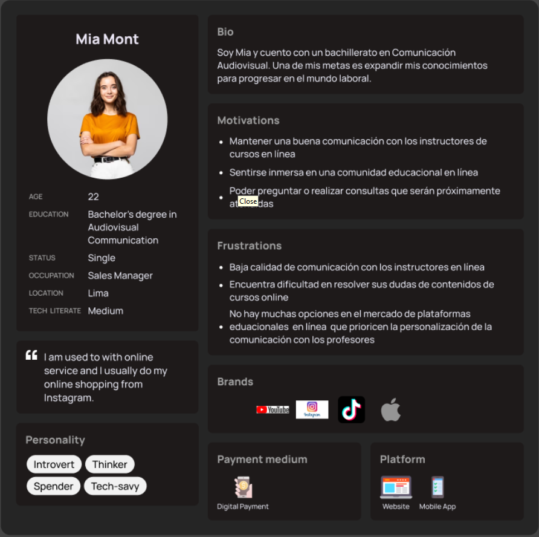

#### User Persona 2: Tutores

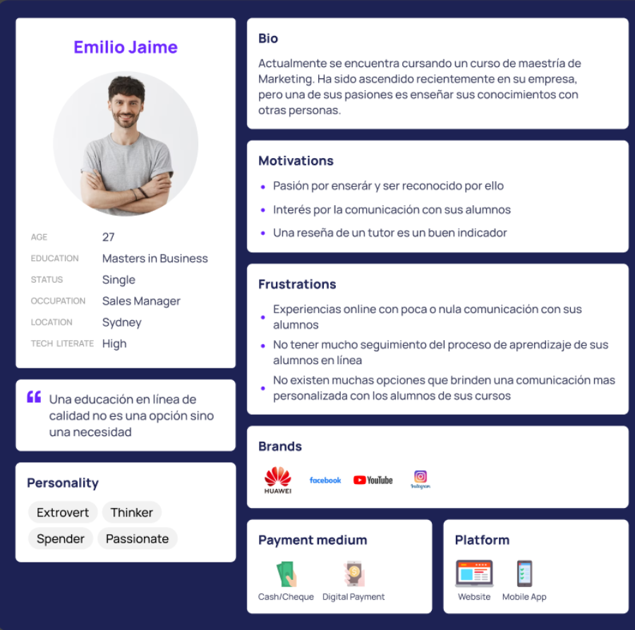

### 2.3.2. User Task Matrix

Para el User Task Matrix, consideraremos los segmentos brindados por los User Persona: Usuario Aprendiz y Usuario Tutor.

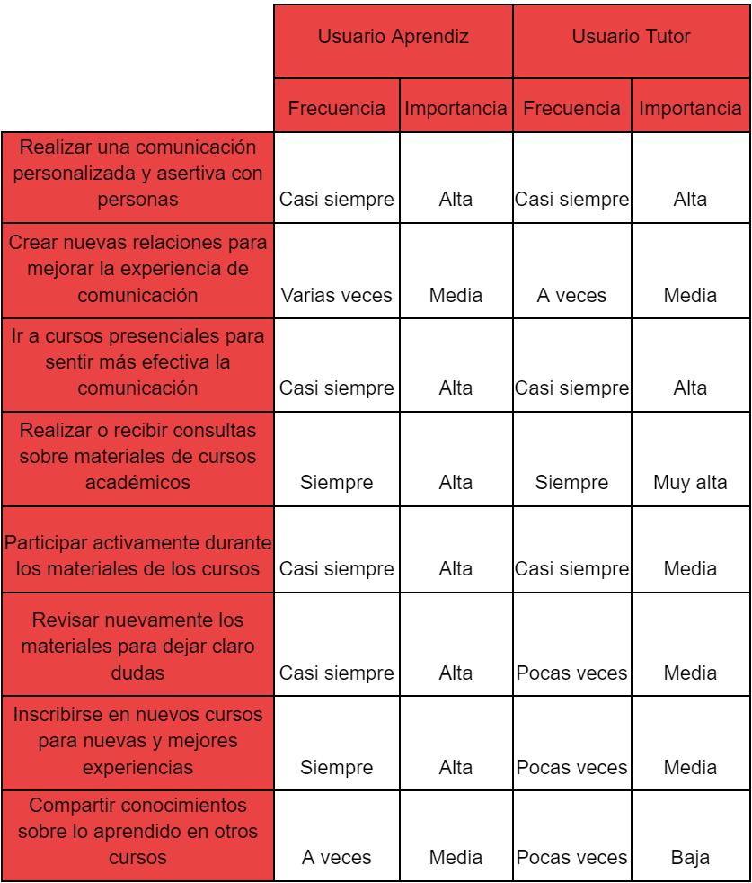

Observamos que la tarea con mayor importancia y frecuencia es realizar o recibir consultas sobre materiales de cursos
académicos. Inferimos pues, que el preguntar por dudas durante las clases de cursos resulta de suma importancia tanto
para los alumnos y profesores.

Vemos una diferencia entre la importancia de una tarea en específico la cual es: Inscribirse en nuevos cursos para
nuevas y mejores experiencias. Podemos intuir que las malas experiencias de cursos son mayores en los alumnos que en los
tutores, resaltando así la importancia de poder brindarles un mejor y personalizable proceso de aprendizaje en un
futuro.

### 2.3.3. User Journey Mapping

En este User Journey Mapping se presentarán a continuación los end-to-end journey de los dos segmentos establecidos.

### Segmento 1: Alumno

Vemos que el end-to-end journey de un usuario aprendiz inicia con mucho interés y alegría, emociones que se van
perdiendo a lo largo del camino. Gran parte del cambio se da en la etapa de inscripción de un curso en el cual salta la
duda y la incertidumbre si valdrá la pena gastar dinero en un curso que no te certifica al 100% aprender de manera
íntegra de la mano de la ayuda del tutor correspondiente.

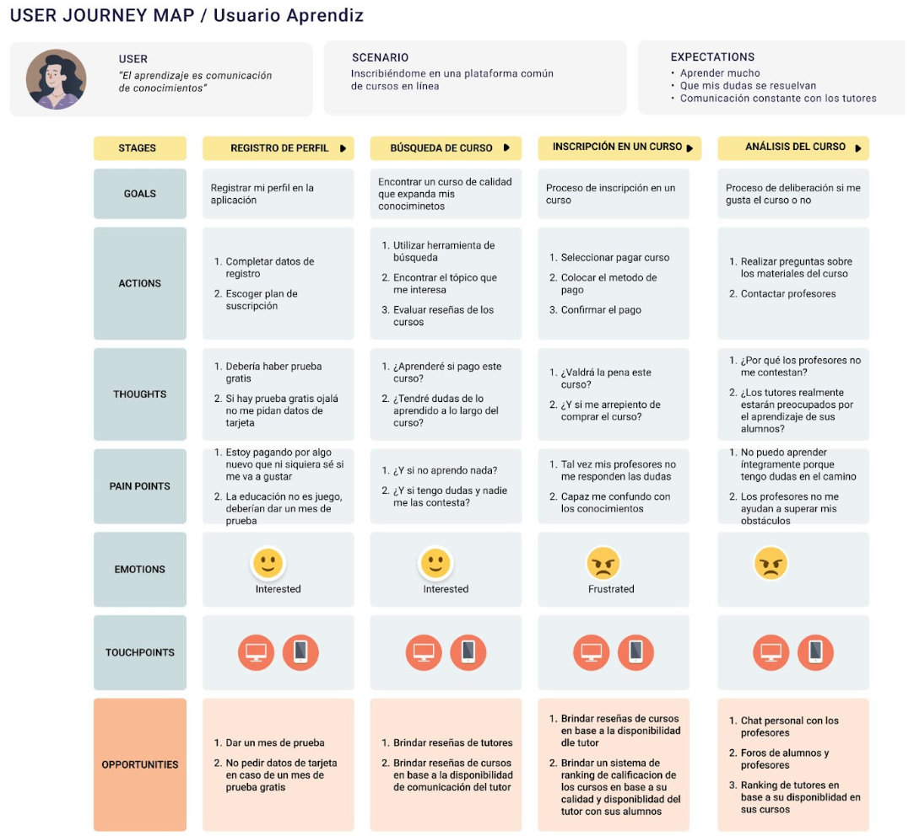

### Segmento 2: Tutor

Observamos que el end-to-end journey de un usuario tutor empieza con el registro de su perfil. Luego se va a publicar un
curso en el cual presenta muchas dudas si su curso tendrá éxito en la plataforma. Más adelante en el recibimiento y
análisis del feedback se da cuenta de que le falta mucho para ganar un buen rendimiento en la plataforma. Gran parte de
la culpa la tienen las limitaciones de la plataforma para tutores nuevos, que no brindan opciones para que estos sean
reconocidos cómo debe ser.

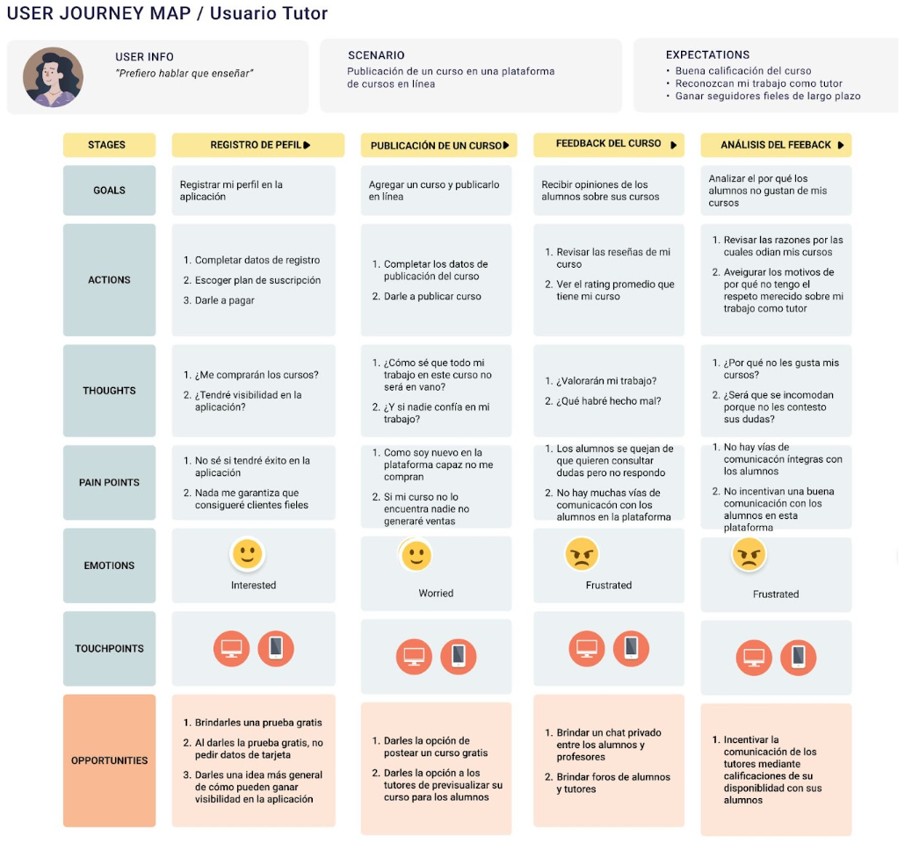

### 2.3.4. Empathy Mapping

### Segmento 1: Alumno

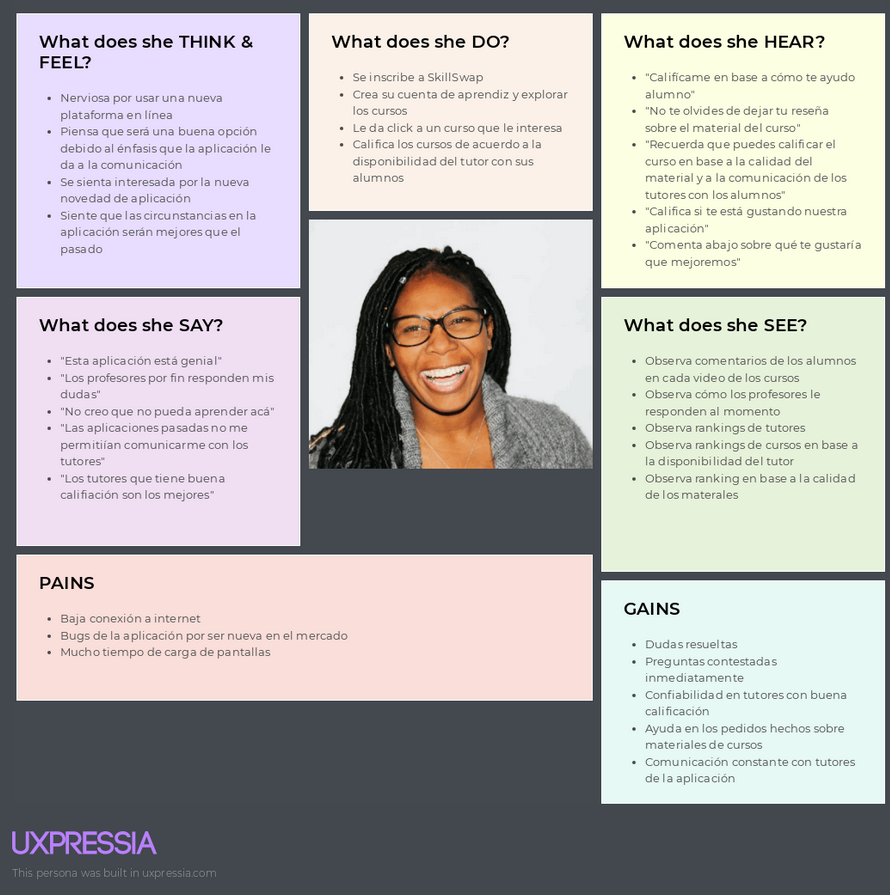

### Segmento 2: Tutor

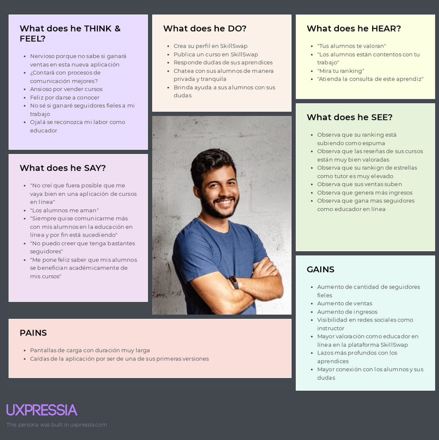

### 2.3.5. As-is Scenario Mapping

A continuación se presentarán el flujo de trabajo de los segmento en la actualidad, es decir sin nuestra solución de
software:

### Segmento 1: Alumnos

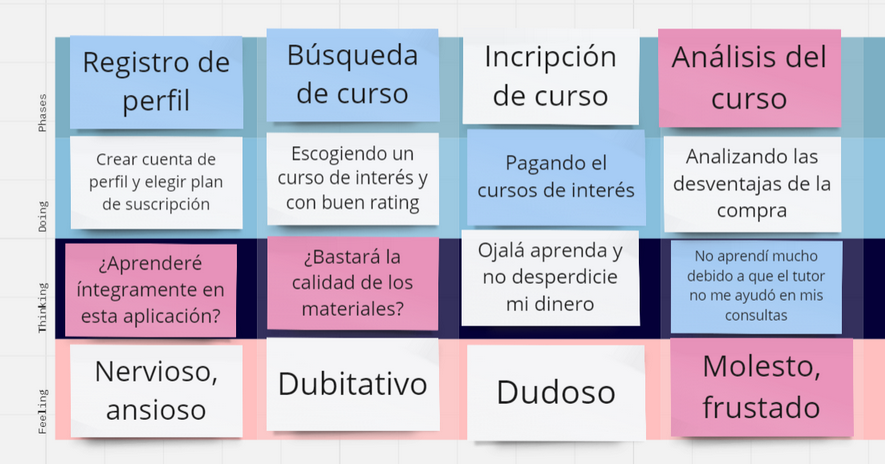

### Segmento 2: Tutores

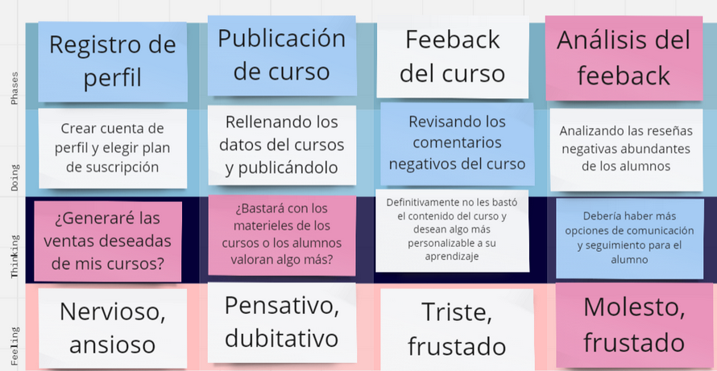

## 2.4. Ubiquitous Language

A continuación presentaremos un glosario de términos con definiciones utilizadas en business domain. Cabe resaltar que
estos términos están relacionados al área de especialidad de nuestra solución de software.

- Private messaging: Una función que habilita la comunicación directa entre instructores y alumnos dentro de la
  aplicación de cursos en línea, permitiendo interacciones individuales y la resolución de consultas de manera
  personalizada.

- Instructor Evaluation: Un sistema que permite a los alumnos valorar la efectividad y calidad de la comunicación y
  asistencia brindada por los instructores, expresando su nivel de satisfacción mediante una calificación o valoración.

- Course: Un plan estructurado de aprendizaje entregado digitalmente a través de una plataforma en línea, compuesto
  generalmente por lecciones, actividades, evaluaciones y recursos educativos.

- Instructor: Un individuo encargado de crear, impartir y gestionar el contenido de un curso en línea, brindando
  orientación y apoyo a los estudiantes.

- Student: Una persona inscrita en un curso en línea con el objetivo de adquirir conocimientos, habilidades o
  certificaciones mediante actividades de aprendizaje en internet.

- Study Plan: El diseño general y la estructura de un curso en línea, que incluye sus objetivos, contenido, secuencia y
  métodos de evaluación.

- Unit: Un componente independiente dentro de un curso en línea que aborda un tema específico o un objetivo de
  aprendizaje, usualmente compuesto por varias lecciones o actividades.

- Enroll: El proceso mediante el cual los estudiantes se inscriben en un curso en línea para acceder a su contenido y
  recursos educativos.

- Platform: La infraestructura digital o aplicación de software utilizada para alojar, entregar y gestionar cursos en
  línea, que incluye herramientas para la creación de contenido, administración de usuarios y análisis de datos.

- User Profile: Una representación digital de un estudiante o profesor dentro de la plataforma de cursos en línea, que
  contiene información personal, preferencias e historial de actividad.

- Feedback: Información proporcionada a los estudiantes por instructores o compañeros sobre su desempeño, progreso o
  entregas dentro del curso.

- Assessment: Actividades o tareas diseñadas para medir la comprensión, conocimientos o habilidades de los estudiantes,
  que pueden incluir cuestionarios, exámenes, proyectos o trabajos.

- Progress Monitoring: El proceso de supervisar y registrar el avance de los estudiantes a lo largo de un curso en
  línea, incluyendo actividades completadas, puntuaciones y tiempo dedicado.

- Certificate: Un reconocimiento formal o credencial otorgado a los estudiantes al completar con éxito un curso en
  línea, que indica su logro y competencia en una determinada área temática.

- Collaboration: Actividades y herramientas dentro de la plataforma del curso que facilitan la interacción, comunicación
  y trabajo en equipo entre estudiantes y profesores.

- Accessibility: El grado en que la plataforma del curso en línea y su contenido están diseñados para ser utilizados y
  navegados por personas con diversas habilidades, incluidas aquellas con discapacidades.

- Mobile learning: La entrega de contenido y actividades del curso a través de dispositivos móviles como teléfonos
  inteligentes y tabletas, que permite a los estudiantes acceder a materiales de aprendizaje en cualquier momento y
  lugar.

---

# Capítulo III: Requirements Specification

## 3.1 To-Be Scenario Mapping

Presentamos la experiencia de nuestros dos segmentos con nuestra solución de software:

### Segmento 1: Alumno

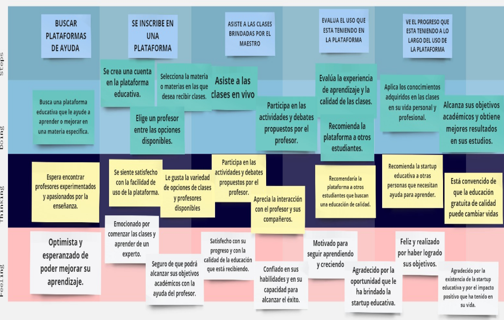

### Segmento 2: Tutor

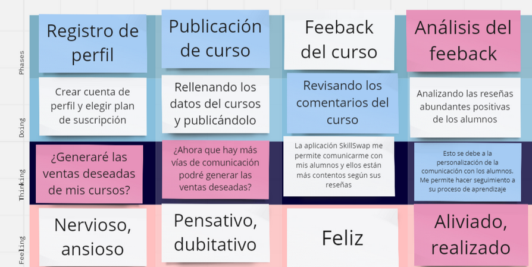

## 3.2. User Stories

Para elaborar user stories que pertenecen a un epic. A continuación, las epics que consideramos como equipo:

| ID   | Titulo                             | Epic                                                                                                                                                                                                                                                                      |
|------|------------------------------------|---------------------------------------------------------------------------------------------------------------------------------------------------------------------------------------------------------------------------------------------------------------------------|
| EP01 | Gestion de usuarios                | __Como__ usuario nuevo   __quiero__ poder registrarme como tutor o alumno en la plataforma   __para__ acceder a todas las funcionalidades disponibles y participar en la comunidad de aprendizaje                                                                   |
| EP02 | Búsqueda y Filtrado                | __Como__ usuario interesado en encontrar un tutor o clase específica   __quiero__ poder buscar y filtrar los resultados según mis criterios   __para__ encontrar rápidamente la tutoría o clase que mejor se adapte a mis necesidades y preferencias                |
| EP03 | Reserva y Gestión de Sesiones      | __Como__ usuario que desea recibir tutorías o clases   __quiero__ poder reservar una sesión de tutoría de manera fácil y rápida   __para__ asegurar mi participación y planificar mi tiempo de estudio de manera efectiva                                           |
| EP04 | Publicación y Gestión de Clases    | __Como__ profesor o tutor    __quiero__ poder publicar mis clases en la plataforma   __para__  compartir mis conocimientos y habilidades con los alumnos interesados y gestionar mis sesiones de enseñanza de manera eficiente                                      |
| EP05 | Personalización de la Experiencia: | __Como__ usuario de la plataforma   __quiero__ poder personalizar mi experiencia de aprendizaje   __para__ adaptar el contenido y la interfaz de la plataforma según mis preferencias individuales y maximizar mi efectividad de aprendizaje                        |
| EP06 | Notificaciones                     | __Como__ usuario de la plataforma   __quiero__ recibir notificaciones sobre opiniones de mis cursos y nuevos cursos disponibles   __para__  estar al tanto de las actualizaciones relevantes y participar activamente en la comunidad                               |
| EP07 | Gestión de Problemas               | __Como__ usuario que encuentra algún problema técnico o de comportamiento   __quiero__ poder reportarlo de manera fácil y rápida   __para__ garantizar un entorno seguro y funcional para todos los usuarios de la plataforma                                       |
| EP08 | Análisis del Rendimiento           | __Como__ profesor   __quiero__ tener acceso a análisis detallados del rendimiento de los alumnos en los cursos   __para__ evaluar la efectividad de los cursos, identificar áreas de mejora y brindar un mejor apoyo a los estudiantes en su proceso de aprendizaje |

A continuacion, la realizacion de los user stories con sus criterios de aceptacion con escenarios e ID de Epica:

| User Stories | Titulo                                                | Descripcion                                                                                                                                                                                                 | Criterios de Aceptacion                                                                                                                                                                                                                                                                                                                                                                                                                                                                                                                                                                                                                                                                                                                                                                                                                                                         | Relacion con (EPIC ID) | 
|--------------|-------------------------------------------------------|-------------------------------------------------------------------------------------------------------------------------------------------------------------------------------------------------------------|---------------------------------------------------------------------------------------------------------------------------------------------------------------------------------------------------------------------------------------------------------------------------------------------------------------------------------------------------------------------------------------------------------------------------------------------------------------------------------------------------------------------------------------------------------------------------------------------------------------------------------------------------------------------------------------------------------------------------------------------------------------------------------------------------------------------------------------------------------------------------------|------------------------|
| US01         | Registrarse como tutor                                | __Como__ usuario tutor  __quiero__ que la plataforma ofrezca  un servicio en el cual me permita poder registrarse de forma sencilla y rápida   __para__ que sea intuitivo con los demás usuarios    | ESCENARIO 1: Tutor se crea una cuenta   Dado que el tutor desea registrarse. Cuando el tutor accede al formulario de registro   Y completa el formulario con sus datos personales, experiencia y áreas de conocimiento   Entonces el sistema registra al tutor y le crea un perfil en la plataforma.      ESCENARIO 2:Registro fallido   Dado que el tutor quiere ingresar a la plataforma   Cuando el tutor esté en los campos del formulario de creación de cuenta   Y ingrese datos incorrectos o deja espacios en blancos   Entonces el sistema muestra un mensaje informando que no se ha podido registrar la cuenta por los datos inválidos                                                                                                                                                                                                   | EP01                   |
| US02         | Buscar tutores                                        | __Como__ usuario interesado en encontrar un tutor o clase específica  __quiero__ poder encontrar tutores que se ajusten a mis necesidades  __para__ poder adquirir conocimientos                    | ESCENARIO 1: Alumnos buscan maestros  Dado que un alumno busca un tutor.  Cuando el alumno ingresa a la sección de búsqueda de tutores.  Y selecciona la materia, ubicación y disponibilidad que desea.  Entonces el sistema muestra una lista de tutores que coinciden con los criterios seleccionados.   ESCENARIO 2: Elección de tutor  Dado que el alumno realizó la búsqueda de un tutor,  Cuando tenga en mente a cuál elegir al ver su perfil y decida hacerlo,  Entonces podrá observar el curso que brinda el tutor, las horas a trabajar, etc.                                                                                                                                                                                                                                                                                             | EP02                   |
| US03         | Reservar una Sesión de Tutoría                        | __Como__ usuario alumno   __quiero__ reservar una sesión de tutoría con un tutor específico   __para__ que me pueda ayudar con mis cursos a tratar                                                  | ESCENARIO 1: Reservar tutoría   Dado que un alumno ha encontrado un tutor.   Cuando el alumno selecciona al tutor y la fecha/hora deseada para la sesión.   Y realiza la reserva de la sesión a través de la plataforma.   Entonces el sistema confirma la reserva y crea un evento en el calendario del tutor y del alumno.    ESCENARIO 2: Confirmación de la reserva   Dado que el alumno ha realizado una reserva de tutoría,   Cuando la plataforma le muestra la fecha, hora y nombre del profesor,   Entonces previamente le llegará una notificación sobre la reserva.                                                                                                                                                                                                                                                                       | EP03                   |
| US04         | Gestionar Perfil de Usuario                           | __Como__ usuario tutor o usuario alumno  __quiero__ poder editar la información personal y profesional en mi perfil, como mi nombre y foto,  __para__ actualizarla cada vez que culmine un curso.   | ESCENARIO 1: Crear perfil   Dado que un tutor o un alumno desea editar su perfil.   Cuando el tutor o el alumno accede a la sección de edición de perfil.   Y realiza los cambios que desea en la información personal y profesional.   Entonces el sistema guarda los cambios y los actualiza en el perfil del usuario.    ESCENARIO 2: Edición de perfil fallido   Dado que el alumno ha colocado su información personal como la edad, nombre de usuario, contraseña,   Cuando el sistema detecte que el nombre de usuario ya está en uso y la contraseña es muy frágil,   Entonces el sistema no lo dejará editar el perfil.                                                                                                                                                                                                                     | EP01                   |
| US05         | Ver perfil de tutor o maestro                         | __Como__ usuario alumno   __quiero__ poder ver el perfil de un tutor o maestro antes de contactarlo   __para__ saber que tan bueno es enseñando.                                                    | ESCENARIO 1: Ver perfiles de los maestros   Dado que un alumno está interesado en un tutor o maestro específico.   Cuando el usuario hace clic en el perfil del tutor o maestro.   Y el sistema muestra información detallada sobre el tutor o maestro, como su experiencia, calificación, tarifas y disponibilidad.   Entonces, el alumno puede tomar una decisión informada sobre si contactar al tutor o maestro.    ESCENARIO 2: Comparar diferentes tutores   Dado que un usuario alumno está buscando un tutor para una materia específica.   Cuando el usuario busca tutores en la plataforma de la startup educativa.   Y la plataforma le permite al usuario filtrar los resultados de búsqueda por materia y disponibilidad.   Entonces el usuario puede comparar diferentes tutores y elegir el que mejor se adapte a sus necesidades. | EP01                   |
| US06         | Personalizar la experiencia de aprendizaje            | __Como__ usuario tutor   __quiero__ personalizar la experiencia de aprendizaje   __para__ adaptarlo a las necesidades e intereses del alumno                                                        | ESCENARIO 1: Personalización del curso   Dado que un tutor desea personalizar la experiencia de su curso.   Cuando el tutor selecciona la opción "editar".   Y elige lo que quiere editar en su curso,   Entonces se puede editar el curso y las actividades para cada alumno, mostrando solo el tema que les interesa.    ESCENARIO 2: Asistencia en la personalización del curso   Dado que un tutor desea personalizar la experiencia de su curso pero no sabe de qué forma.   Cuando el tutor selecciona la opción “editar”.   Y elige lo que quiere editar en su curso,   Entonces la página ofrece una edición automática, mostrando un tema más resumido y adecuado para lo que busca el alumno.                                                                                                                                           | EP05                   |
| US07         | Notificaciones de opiniones respecto a mi curso       | __Como__ usuario tutor   __quiero__ recibir notificaciones cuando los estudiantes se inscriban en mis clases o dejen comentarios y calificaciones   __para__ poder interactuar con ellos            | ESCENARIO 1: Notificaciones de inscripción en el curso   Dado que deseo recibir notificaciones al momento en que se inscriban a mi curso.   Cuando vaya a la opción de “tus cursos”.   Y seleccione “notificaciones”.   Entonces podré activar la opción "notificar cuando un estudiante se inscriba".    ESCENARIO 2: Notificaciones de calificaciones y opiniones en el curso   Dado que deseo recibir notificaciones al momento en que califiquen o opinen sobre mi curso.   Cuando vaya a la opción de “tus cursos”.   Y seleccione “notificaciones”.   Entonces podré activar la opción "notificar cuando un estudiante califique".                                                                                                                                                                                                          | EP06                   |
| US08         | Ordenar por criterios                                 | __Como__ usuario alumno   __quiero__ poder ordenar las clases en línea por diferentes criterios, como precio, calificación o popularidad   __para__ encontrar la opción más adecuada para mí.       | ESCENARIO 1: Ordenar cursos por precio   Dado que un alumno quiere tomar un curso que pueda pagar.   Cuando seleccione la opción "Orden"   Y elija "precio".   Entonces aparecerán los cursos más baratos dentro de su búsqueda.    ESCENARIO 2: Ordenar cursos por popularidad   Dado que el alumno quiere tomar un curso popular para sentirse más seguro.   Cuando seleccione la opción "Orden".   Y elija "popularidad".   Entonces los cursos con mayor popularidad se mostrarán en la parte superior para su elección.                                                                                                                                                                                                                                                                                                                      | EP02                   |
| US09         | Reportar un problema                                  | __Como__ usuario alumno   __quiero__ reportar un problema que tenga en la web __para__ que puedan solucionarlo rápidamente                                                                              | ESCENARIO 1: Reportar un problema técnico  Dado que un alumno tiene un problema técnico con la plataforma.  Cuando acceda a la opción de reportes.  Y escriba su reporte.  Entonces el equipo de soporte técnico revisará el reporte y enviará una notificación al solucionarlo.   ESCENARIO 2: Contactar al servicio al cliente  Dado que un alumno tiene un problema con la plataforma y no puede enviar un reporte.  Cuando deslice la página hacia abajo.  Entonces encontrará un correo y número para servicio al cliente.  Y podrá reportar su problema por ese medio.                                                                                                                                                                                                                                                                      | EP07                   |
| US010        | Denuncia de acoso por parte del usuario               | __Como__ usuario alumno   __quiero__ poder denunciar casos de acoso por parte de otros usuarios   __para__ mantener un entorno seguro                                                               | ESCENARIO 1: Reportar comentario   Dado que un usuario alumno encuentra un comentario abusivo de otro usuario.   Cuando haga clic en la opción de reportar.   Y llene el formulario de reporte de comentario.   Entonces el sistema registrará el reporte del usuario que hizo el reporte.    ESCENARIO 2: Reportar comportamiento inapropiado en clase   Dado que el usuario alumno experimenta un comportamiento inapropiado o abuso durante una clase.   Cuando haga clic en la opción de reporte.   Entonces el sistema registrará el reporte y avisará al profesor para su intervención inmediata.                                                                                                                                                                                                                                              | EP07                   |
| US011        | Registrarse como alumno                               | __Como__ alumno   __quiero__ crearme una cuenta   __para__ poder acceder a la aplicación y a sus funcionalidades                                                                                    | ESCENARIO 1: Reportar comentario   Dado que un usuario alumno encuentra un comentario abusivo de otro usuario.   Cuando haga clic en la opción de reportar.   Y llene el formulario de reporte de comentario.   Entonces el sistema registrará el reporte del usuario que lo realizó.    ESCENARIO 2: Reportar comportamiento inapropiado en clase   Dado que el usuario alumno experimenta un comportamiento inapropiado o abuso durante una clase.   Cuando haga clic en la opción de reporte.   Entonces el sistema registrará el reporte y avisará al profesor para su intervención inmediata.                                                                                                                                                                                                                                                   | EP01                   |
| US012        | Publicación de clases por parte del profesor          | __Como__ profesor   __quiero__ publicar y gestionar mis clases en la plataforma   __para__ que los alumnos puedan inscribirse                                                                       | ESCENARIO 1: Registro Exitoso   Dado que un alumno quiere usar la plataforma.   Cuando se crea su cuenta.   Y la personaliza de manera adecuada.   Entonces podrá navegar por la plataforma y buscar al maestro deseado.    ESCENARIO 2: Registro Fallido   Dado que el alumno quiere ingresar a la plataforma.   Cuando el alumno esté en los campos del formulario de creación de cuenta.   Y ingrese datos incorrectos o deje espacios en blanco.   Entonces el sistema muestra un mensaje informando que no se ha podido registrar la cuenta por los datos inválidos.                                                                                                                                                                                                                                                                         | EP04                   |
| US013        | Notificaciones de cursos                              | __Como__ usuario alumno   __quiero__ recibir notificaciones sobre nuevas clases en línea agregadas que puedan ser de mi interés   __para__ estar siempre actualizado sobre las opciones disponibles | ESCENARIO 1: Publicación de clase Exitosa   Dado que el profesor ha iniciado sesión en su cuenta.   Cuando accede a la opción de publicar una nueva clase.   Y llena los campos del formulario necesarios para publicar una clase.   Entonces el sistema registra la clase y la muestra en la lista de clases disponibles.    ESCENARIO 2: Edición de clase existente   Dado que el profesor ha publicado una clase previamente.   Cuando accede a la opción de editar una clase existente.   Y realiza las ediciones necesarias en la clase existente.   Entonces el sistema actualiza la clase con los nuevos detalles.                                                                                                                                                                                                                         | EP06                   |
| US014        | Desactivar notificaciones                             | __Como__ usuario alumno, quiero desactivar las notificaciones sobre nuevas clases en línea para quitar las que ya no me interesan                                                                           | ESCENARIO 1: Configuración de notificaciones de curso   Dado que un usuario alumno desea mantenerse informado sobre algún curso o tema.   Cuando vaya a la opción de “configuración”.   Y seleccione “notificaciones”.   Entonces podrá elegir el curso que le interesa para recibir notificaciones.    ESCENARIO 2: Seguir a un profesor para recibir notificaciones de clases   Dado que un usuario alumno desea continuar viendo clases de algún profesor.   Cuando vaya al perfil del profesor.   Y seleccione la opción de seguir.   Entonces podrá elegir si desea recibir notificaciones cada vez que el profesor publique una nueva clase.                                                                                                                                                                                                | EP06                   |
| US015        | Análisis del rendimiento de los alumnos en los cursos | __Como__ usuario tutor   __quiero__ poder ver estadísticas y análisis sobre el rendimiento de mis clases   __para__ evaluar la efectividad de mis enseñanzas                                        | ESCENARIO 1: Desactivar notificaciones de un curso   Dado que un usuario alumno quiere desactivar las notificaciones de un curso que ya no es de su interés.   Cuando vaya a la opción de “configuración”.   Y seleccione “notificaciones”.   Entonces podrá seleccionar las notificaciones del curso que estaban activadas para desactivarlas.    ESCENARIO 2: Desactivar notificaciones de clases de un profesor   Dado que un usuario alumno quiere desactivar las notificaciones de clases de un profesor que ya no es de su interés.   Cuando vaya a la opción de “configuración”.   Y seleccione “notificaciones”.   Entonces podrá seleccionar las notificaciones relacionadas con el profesor que estaban activadas para desactivarlas.                                                                                                   | EP08                   |

## 3.3. Impact Mapping

**Segmento objetivo: Tutor**

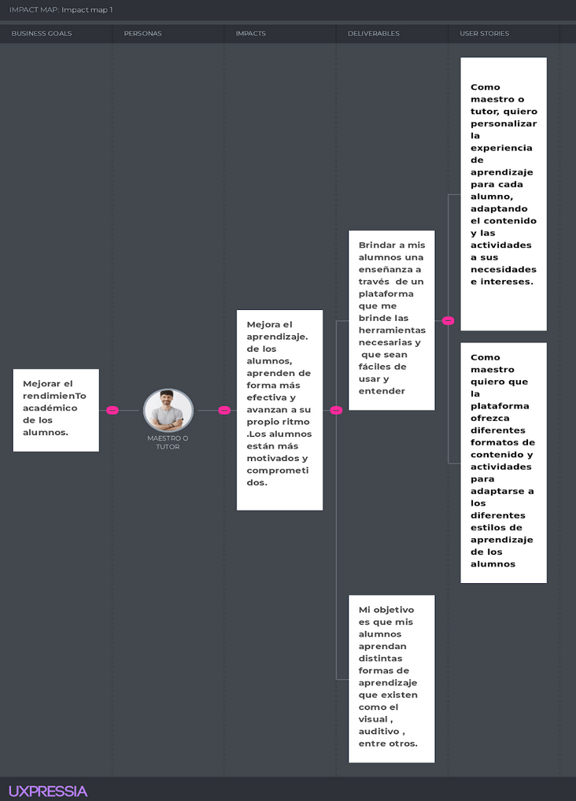

**Segmento objetivo: Alumno**

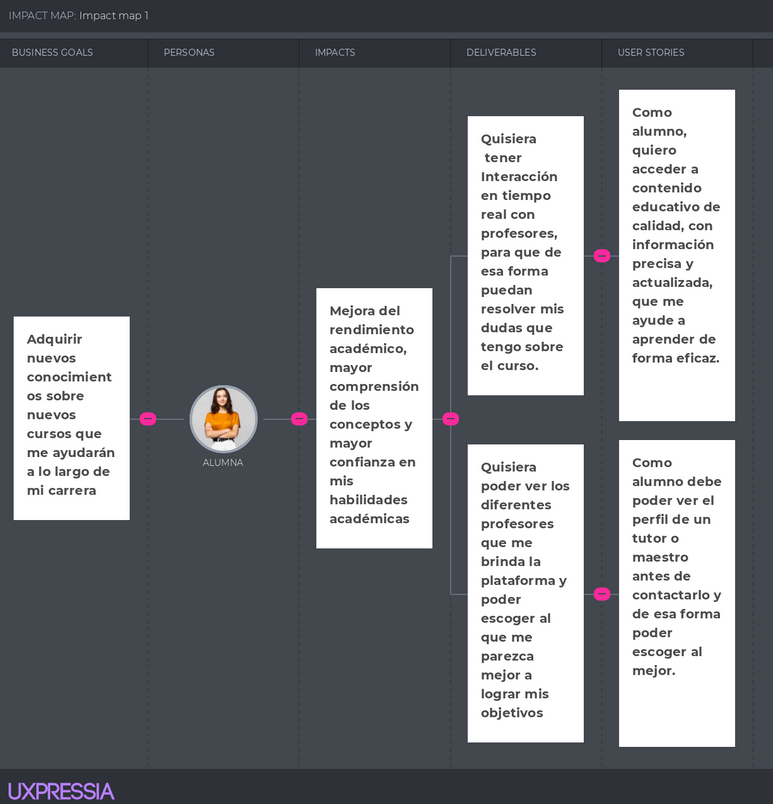

## 3.4. Product Backlog

| # Orden | User Story Id | Titulo                                       | Desripcion                                                                                                                                                                                                | Story Points (1/2/3/4/5/8) |
|---------|---------------|----------------------------------------------|-----------------------------------------------------------------------------------------------------------------------------------------------------------------------------------------------------------|----------------------------|
| 1       | US01          | Registrarse como tutor                       | __Como__ usuario tutor  __quiero__ que la plataforma ofrezca  un servicio en el cual me permita poder registrarse de forma sencilla y rápida   __para__ que sea intuitivo con los demás usuarios  | 8                          |
| 2       | US011         | Registrarse como alumno                      | __Como__ alumno   __quiero__ crearme una cuenta   __para__ poder acceder a la aplicación y a sus funcionalidades                                                                                  | 8                          |
| 3       | US04          | Gestionar Perfil de Usuario                  | __Como__ usuario tutor o usuario alumno  __quiero__ poder editar la información personal y profesional en mi perfil, como mi nombre y foto,  __para__ actualizarla cada vez que culmine un curso. | 3                          |
| 4       | US05          | Ver perfil de tutor o maestro                | __Como__ usuario alumno   __quiero__ poder ver el perfil de un tutor o maestro antes de contactarlo   __para__ saber que tan bueno es enseñando.                                                  | 3                          |
| 5       | US02          | Buscar tutores                               | __Como__ usuario interesado en encontrar un tutor o clase específica  __quiero__ poder encontrar tutores que se ajusten a mis necesidades  __para__ poder adquirir conocimientos                  | 5                          |
| 6       | US012         | Publicación de clases por parte del profesor | __Como__ profesor   __quiero__ publicar y gestionar mis clases en la plataforma   __para__ que los alumnos puedan inscribirse                                                                     | 5                          |
| 7       | US08          | Ordenar por criterios                        | __Como__ usuario alumno   __quiero__ poder ordenar las clases en línea por diferentes criterios, como precio, calificación o popularidad   __para__ encontrar la opción más adecuada para mí.     | 2                          |

---

# Capítulo IV: Product Design

## 4.1. Style Guidelines

### 4.1.1. General Style Guidelines

**Brandin:** La aplicación adoptará un estilo moderno y amigable, reflejando nuestra identidad como una plataforma de
educación innovadora y accesible.

**Typography:** El tipo de fuente que se va a utilizar para los títulos con tamaño de letra 50, subtítulos con tamaño 40
es Sans Serif.

**Colors:** La paleta de colores se basará en tonos vibrantes y acogedores para mantener un ambiente estimulante y
motivador

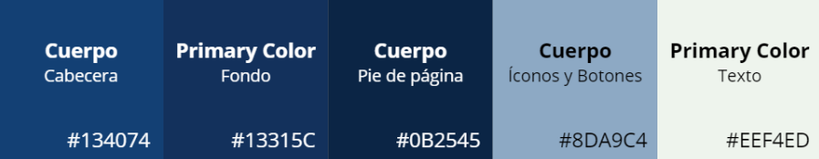

**Spacing:** Se seguirá un sistema de espaciado coherente para garantizar una disposición visualmente equilibrada y una
experiencia de usuario cómoda

**Tone of Communication:** La comunicación será informal y amigable, manteniendo un tono respetuoso y motivador.

### 4.1.2. Web Style Guidelines

La paleta de colores que usamos será la misma que para el general, para evitar que haya colores fuera de lugar que no
queden con la página.

Aparte de la tipografía general, aquí también utilizaremos el tipo de texto Etna Sans Serif por la forma del texto que
se podría usar para el nombre de los cursos, como este sería para nombres de los cursos, que son importantes en nuestra
página. Llevaría un tamaño de 34

y luego un Sanchez para la descripción de algún curso. Al ser un texto para descripciones, el tamaño sería de 28

## 4.2. Information Architecture

### 4.2.1. Organization Systems

En los sistemas de organización de la aplicación, nos basamos en la estructura visual del contenido para garantizar una
experiencia intuitiva para el usuario. En este caso usaremos la organización jerárquica:

En la página principal tendremos menús desplegables que contienen las distintas secciones de la web para poder acceder a
cada una de ellas. Con esta funcionalidad el usuario tendrá una navegación fluida sin muchos problemas y mostraremos
información relevante. La página tendrá una descripción de lo que busca la página y de qué forma nos ayuda. Este
contexto relevante ayudará a que los usuarios sepan los beneficios que tendrán por usar nuestra plataforma.

### 4.2.2. Labeling Systems

Usaremos un lenguaje más informal y amigable buscando siempre tener un tono respetuoso para la confianza con el usuario

| Mi perfil     | Esta etiqueta mostrará a los usuarios sus datos personales y, si sube algún curso, sus cursos publicados.                                                                                     |
|---------------|-----------------------------------------------------------------------------------------------------------------------------------------------------------------------------------------------|
| Ayuda         | Esta etiqueta proporcionará acceso a recursos de asistencia y reclamos por si tuvieron algún problema.                                                                                        |
| Home          | Página principal de la web                                                                                                                                                                    |
| Tienda        | Vista para poder elegir que oferta pagar para tener las monedas virtuales de la web                                                                                                           |
| Configuracion | Aquí podrán editar los cursos que les llame más la atención para mostrar cursos distintos que le interesen al usuario. Además,  podrán cambiar el número de su tarjeta guardada para compras. |

### 4.2.3. SEO Tags and Meta Tags

| Tipos         | Etiquetas         | Descripción                                                                                                                                                                                                                                                                                      |
|---------------|-------------------|--------------------------------------------------------------------------------------------------------------------------------------------------------------------------------------------------------------------------------------------------------------------------------------------------|
| **SEO tags**  | Headers           | Las etiquetas de los encabezados estarán compuestos de información importante de nuestra aplicación como el nombre y descripción.                                                                                                                                                                |
| **SEO tags**  | Url               | Emplearemos una Url sencilla y fácil de recordar, sin caracteres extraños para su fácil búsqueda. La url a emplear será simple: www.skillswap.com.                                                                                                                                               |
| **SEO tags**  | Alt Labels Images | Emplearemos pequeñas descripciones en las imágenes de nuestra aplicación para una comprensión más sencilla.                                                                                                                                                                                      |
| **Meta tags** | Meta Title        | Muestra el título de la página que aparece en la barra de título del navegador.                                                                                                                                                                                                                  |
| **Meta tags** | Meta Description  | Proporciona una breve descripción de la página que se mostrará en los resultados de búsqueda. Y usaremos la descripción de: “Descubre, enseña y aprende: tu plataforma para adquirir y compartir tu conocimiento” Una frase simple que resume de manera optimista la idea de nuestra aplicación. |
| **Meta tags** | Meta Keywords     | Indican palabras clave de la página. Las palabras clave serán: productos informáticos, cursos, recursos informativos, búsqueda, ayuda.                                                                                                                                                           |

### Para el sitio web estático:

### 4.2.4. Searching Systems

Para la búsqueda de datos usaremos:

- **Tablas y listas:** Con esto mostraremos información general y de manera organizada para que el usuario pueda
  encontrar más sencillo lo que busca.

- **Barra de búsqueda:** La barra de búsqueda se hará presente en la búsqueda de algún curso que esté buscando el
  usuario. De esta manera, los usuarios podrán buscar sus intereses más rápido.

- **Inicio estático:** En el peor de los casos donde un usuario se pierda en la web, tendremos este botón que ayudará a
  que el usuario regrese a la página principal.

### 4.2.5. Navigation Systems

Cuando los usuarios accedan a nuestra plataforma, encontrarán una interfaz fácil de usar que les proporcionará acceso a
distintos cursos relacionados con sus preferencias. La aplicación cuenta con un diseño sencillo que permite a los
usuarios explorar sus opciones de manera fácil, incluso para las personas que no tienen mucho conocimiento de
tecnología.

La funcionalidad de búsqueda se ha mejorado para que los usuarios puedan encontrar los cursos que les interesa.
Los resultados de la búsqueda se muestran de manera clara y con una breve descripción para que sepa de lo que trata un
curso, lo que permite a los usuarios tomar decisiones informadas sobre el curso que desean aprender.

## 4.3. Landing Page UI Design

En esta sección se mostrará el desarrollo visual del Landing Page. Para ello, se usuará la herramienta de diseño web
Figma, debido a sus funciones y plugins que nos permite desarrollar el prototipo sin dificultades. Asimismo se
evidenciará el uso de los Style Guidelines e Information architecture.

### 4.3.1. Landing Page Wireframe

### 4.3.2. Landing Page Mock-up

Trabajando con los wireframes anteriormente mostrados, luego se aplicó los Style Guidelines para el uso de los colores.
Como se aprecia, estos tienen un contraste llamativo en cada sección de la landing page.

[Link Figma]()

## 4.4. Web Applications UX/UI Design

### 4.4.1. Web Applications Wireframes

### 4.4.2. Web Applications Wireflow Diagrams

En esta sección, se presentan los wireflows de la aplicación guiándose de las historias de usuario.

#### User Persona Segmento objetivo 1

___

**Usar Goal: Como usuario empresa quiero crearme una cuenta para poder acceder a la aplicación.**

#### User Persona Segmento objetivo 2

**Usar Goal: Como usuario quiero ...**

**Usar Goal: Como usuario quiero**

**Usar Goal: Como usuario...**

### 4.4.3. Web Applications Mock-ups

### 4.4.4. Web Applications User Flow Diagrams

[Link LucidChart]()

**User Goal:**

**Task Flow:**

## 4.5. Web Applications Prototyping

En esta sección, se puede acceder al prototipo en la herramienta Figma. Asismismo se pueden evidenciar los principios de
arquitectura de información, esto hace que la aplicación se vea lo más eficiente posible.

[Link Prototipo]()

## 4.6. Domain-Driven Software Architecture

### 4.6.1. Software Architecture Context Diagram

### 4.6.2. Software Architecture Container Diagrams

### 4.6.3. Software Architecture Components Diagrams

#### User Managment Context

#### Booking Context

#### Scooter Inventory Context

## 4.7. Software Object-Oriented Design

En esta sección, se utilizará el enfoque de diseño orientado a objetos para desarrollar la aplicación web. Asimismo, se
aplicarán los principios y conceptos fundamentales de la programación orientada a objetos.

### 4.7.1. Class Diagrams

En esta sección, se presentarán los diagramas de clases, en las cuales se representan las clases y sus relaciones en el
diseño orientado a objetos.

[Link del Diagrama de Clases]()

### 4.7.2. Class Dictionary

[Link del Diagrama de Clases]()

## 4.8. Database Design

En esta sección, se definirán las tablas y relaciones necesarias para almacenar y gestionar los datos de manera
eficiente.

### 4.8.1. Database Diagram

___

# Capítulo V: Product Implementation, Validation & Deployment

## 5.1. Software Configuration Management

### 5.1.1. Software Development Environment Configuration

#### Software Development:

- Producto: WebStorm

  
- Propósito: Entorno de desarrollo integrado (IDE) específicamente diseñado para el desarrollo web, que proporciona
  herramientas avanzadas para la escritura de código, la depuración, la refactorización y la integración con tecnologías
  web modernas.
- Ruta de descarga: https://www.jetbrains.com/webstorm/download

#### Product UX/UI Design:

- Producto: Figma

  

- Propósito: Diseño de experiencia de usuario (UX) y diseño de interfaz de usuario (UI), colaboración en el diseño y
  prototipado.
- Ruta de referencia: www.figma.com

#### Software Documentation:

- Producto: Markdown

  
- Propósito: Formato de marcado ligero para escribir documentación técnica y de usuario de manera fácil y legible.
- No se requiere una ruta de referencia, ya que es un formato de texto plano.

### 5.1.2. Source Code Management

Para este proyecto, se ha elegido implementar el modelo de flujo de trabajo GitFlow como método de control de versiones.
GitFlow es un modelo de ramificación en Git que utiliza ramas principales y ramas de soporte para organizar el
desarrollo de software de manera eficiente y colaborativa. En nuestro GitFlow, utilizaremos las siguientes ramas
principales y de soporte:

**Rama principal (master):** Esta rama contendrá el código base del proyecto que se considera estable y listo para ser
desplegado en producción. Las confirmaciones en esta rama reflejan versiones del software que han pasado por pruebas
exhaustivas y han sido aprobadas para su lanzamiento

**Rama de desarrollo (develop):** Esta es la rama principal donde se integran todas las características nuevas y los
cambios del código. Las nuevas funcionalidades se desarrollan en ramas de características y se fusionan en esta rama
cuando están listas para ser probadas y revisadas en conjunto

**Ramas de características (feature branches):** Cada nueva funcionalidad o característica del proyecto se desarrolla en
su propia rama de características. Estas ramas se crean a partir de la rama de desarrollo y se eliminan una vez que la
funcionalidad se ha completado, probado y fusionado de vuelta en la rama de desarrollo

**Ramas de publicación (release):** Cuando se está preparando una nueva versión para ser lanzada, se crea una rama de
publicación a partir de la rama de desarrollo. En esta rama se realizan las últimas pruebas de integración, se corrigen
errores menores y se prepara la versión para su lanzamiento

**Ramas de mantenimiento (hotfix branches):** Si surge un problema crítico en producción que necesita ser corregido de
inmediato, se crea una rama de hotfix a partir de la rama principal. Esta rama se utiliza para solucionar el problema
rápidamente y luego se fusiona de vuelta tanto en la rama principal como en la rama de desarrollo

### 5.1.3. Source Code Style Guide & Conventions

**HTML Style Guide and Coding Conventions**

- Atributo Lang: Incluir el atributo lang en la etiqueta `<html>` para especificar el idioma del documento.
- Etiquetas comunes: Se utilizó etiquetas semánticas
  como `<header>`, `<section>`, `<nav>`, `
`, ``, `<iframe>`, `<h1>` `<h2>` para mejorar la estructura y
  accesibilidad del contenido.
- Meta etiqueta: Se implementó metadatos importantes para SEO utilizando la etiqueta <meta> en el <head> del documento.

**CSS Style Guide and Coding Conventions**

- Nombramiento de archivos CSS: Se utilizó nombres en minúsculas para los archivos CSS y evitar el uso de tildes.
- Clases CSS: Se utiliza nombres generales y descriptivos para las clases, separando las palabras con guiones
- Propiedades abreviadas: Se emplean propiedades CSS abreviadas cuando sea posible para reducir la cantidad de líneas de
  código y mejorar la legibilidad.
- Evitar selectores de ID: Se incluyen selectores de clase sobre selectores de ID para facilitar la reutilización y
  evitar conflictos.

**Gherkin Conventions for Readable Specifications**

- Bloques "Given-When-Then": Diferenciar claramente los bloques de Given, When y Then con una correcta indentación y
  utilizando la keyword "And" para agregar más líneas en los pasos si es necesario.
- Tablas para pasos: Se utilizó tablas para organizar y proporcionar información adicional en los pasos de Gherkin.

**Angular Coding Style Guide**

- Angular CLI: Se utilizara Angular CLI para generar componentes, servicios y otros artefactos de Angular de manera
  consistente
- Se utiliza CamelCase para los nombres de los archivos y las clases de los componentes.
- Se mantienen las funciones y métodos cortos y enfocados en una sola responsabilidad.

### 5.1.4. Software Deployment Configuration

Vamos a usar GitHub Pages para nuestra landing page por su alojamiento gratuito y fácil configuración. Ofrece opciones
de personalización de dominio y se integra perfectamente con nuestro flujo de trabajo de desarrollo. Con GitHub Pages,
podemos desplegar rápidamente cambios en nuestra página sin preocuparnos por la complejidad del alojamiento web.

[!LadingPage desplegado]()

## 5.2. Landing Page, Services & Applications Implementation

### 5.2.1. Sprint 1

#### 5.2.1.1. Sprint Planning 1

#### 5.2.1.2. Sprint Backlog 1

#### 5.2.1.3. Development Evidence for Sprint Review

#### 5.2.1.4. Testing Suite Evidence for Sprint Review

#### 5.2.1.5. Execution Evidence for Sprint Review

#### 5.2.1.6. Services Documentation Evidence for Sprint Review

#### 5.2.1.7. Software Deployment Evidence for Sprint Review

#### 5.2.1.8. Team Collaboration Insights during Sprint

---

### 5.2.2. Sprint 2

### 5.2.2.1 Sprint Planning 2

| Sprint #                         | Sprint 2                                                                                                                                                        |
|----------------------------------|-----------------------------------------------------------------------------------------------------------------------------------------------------------------|
| Sprint Planning Background       |                                                                                                                                                                 |
| Date                             | 29-4-2024                                                                                                                                                       |
| Time                             | 18:00 PM                                                                                                                                                        |
| Location                         | Discord                                                                                                                                                         |
| Prepared By                      | Scott Huachaca Advincula,                                                                                                                                       |
| Attendees                        | Scott Huachaca Advincula,                                                                                                                                       |
| Sprint 1 - Review Summary        | Se realizo el informe y el landing page unicamente con html, css y javascript                                                                                   |
| Sprint 1 - Retrospective Summary | Corregir los puntos del informe que faltan reforzar                                                                                                             |
| Sprint Goal & User Stories       |                                                                                                                                                                 |
| Sprint 2 Goal                    | El objetivo del presente Sprint es en desarrollar la funcinalidades mas importanten del fronted de la aplicacion web y corregir los errores del sprint anterior |
| Sprint 2 Velocity                | El equipo puede aceptar (n) Story Points puede aceptar el equipo para este Sprint 2                                                                             |
| Sum of Story Points              | La suma de los Story Point pra los User Stories que se estan incluyendo en este Sprint 2 da un total de (n)                                                     |

### 5.2.2.2 Sprint Planning 2

<table><tr><th valign="top">Sprint 2</th><th colspan="7" valign="top">Sprint: Implementar el frontend de las principales historias de usuario del product backlog </th></tr>
<tr><td colspan="2" valign="top">User Story</td><td colspan="6" valign="top">Work-Item / Task</td></tr>
<tr><td valign="top">Id</td><td valign="top">Title</td><td valign="top">Id</td><td valign="top">Title</td><td valign="top">Description</td><td valign="top">Estimation (Hours)</td><td valign="top">Assigned To</td><td valign="top">
Status 

(To-do / 

InProcess / 

To Review / 

Done)
</td></tr>
<tr><td rowspan="3" valign="top">HU-08</td><td rowspan="3" valign="top">Planificar actividades agrícolas</td><td valign="top">08\.1</td><td valign="top">Implementar fake-api</td><td valign="top">Implementar fake api para posts o gets de entidades</td><td valign="top">3</td><td valign="top">Miguel Huaman</td><td valign="top">Done</td></tr>
<tr><td valign="top">08\.2</td><td valign="top">Implementar estilos </td><td valign="top">Diseñar la página con los Styles Guidelines definidos</td><td valign="top">4</td><td valign="top">Miguel Huaman</td><td valign="top">Done</td></tr>
<tr><td valign="top">08\.3</td><td valign="top">Implementar stepper </td><td valign="top">El stepper consta de 3 pasos y cada uno es de un componente</td><td valign="top">4</td><td valign="top">Miguel Huaman</td><td valign="top">Done</td></tr>
<tr><td rowspan="3" valign="top">HU-04</td><td rowspan="3" valign="top">Realizar pedidos de productos</td><td valign="top">08\.1</td><td valign="top">Implementar fake-api</td><td valign="top">Implementar fake api para posts o gets de entidades</td><td valign="top">3</td><td valign="top">Paolo Espejo</td><td valign="top">Done</td></tr>
<tr><td valign="top">08\.2</td><td valign="top">Implementar estilos </td><td valign="top">Diseñar la página con los Styles Guidelines definidos</td><td valign="top">2</td><td valign="top">Paolo Espejo</td><td valign="top">Done</td></tr>
<tr><td valign="top">08\.3</td><td valign="top">Implementar stepper </td><td valign="top">El stepper consta de 3 pasos y cada uno es de un componente</td><td valign="top">5</td><td valign="top">Paolo Espejo</td><td valign="top">Done</td></tr>
<tr><td rowspan="3" valign="top">HU-03</td><td rowspan="3" valign="top">Explorar productos agrícolas</td><td valign="top">03\.1</td><td valign="top">Implementar estilos</td><td valign="top">Diseñar los estilos para las páginas</td><td valign="top">2</td><td valign="top">Tatiana Paucar</td><td valign="top">In Process</td></tr>
<tr><td valign="top">03\.2</td><td valign="top">Implementar formularios</td><td valign="top">Implementar formularios para añadir cultivos</td><td valign="top">5</td><td valign="top">Tatiana Paucar</td><td valign="top">In process</td></tr>
<tr><td valign="top">03\.3</td><td valign="top">Implementar página de productos</td><td valign="top">Implementar cars para explorar los productos agrícolas</td><td valign="top">4</td><td valign="top">Tatiana Paucar</td><td valign="top">In Process</td></tr>
<tr><td rowspan="3" valign="top">HU-09</td><td rowspan="3" valign="top">Registro de gastos y ganancias</td><td valign="top">09\.1</td><td valign="top">Implementar estilos </td><td valign="top">Diseñar los estilos para las páginas</td><td valign="top">2</td><td valign="top">Jorge Gonzales Carrión</td><td valign="top">Done</td></tr>
<tr><td valign="top">09\.2</td><td valign="top">Implementar las listas de costos y ganancias</td><td valign="top">Implementar con las listbox con el framework requerido</td><td valign="top">5</td><td valign="top">Jorge Gonzales Carrión</td><td valign="top">Done</td></tr>
<tr><td valign="top">09\.3</td><td valign="top">Cards con información de costos y gastos</td><td valign="top">Implementar cards con la información de costos y gatos</td><td valign="top">5</td><td valign="top">Jorge Gonzales Carrión</td><td valign="top">Done</td></tr>
<tr><td valign="top">HU-21</td><td valign="top">Sección principal (“Home”)</td><td valign="top">21\.1</td><td valign="top">Paginas de “Home”</td><td valign="top">Implementar páginas de “Home”</td><td valign="top">4</td><td valign="top">Jose Zarate</td><td valign="top">Done</td></tr>
<tr><td valign="top">HU-01</td><td valign="top">Selección de roles</td><td valign="top">01\.1</td><td valign="top">Pantallas de registro de cuentas</td><td valign="top">Implementar  inicio de sesión mediante componentes</td><td valign="top">3</td><td valign="top">Scott Huachaca</td><td valign="top">Done</td></tr>
<tr><td valign="top">HU-02</td><td valign="top">Inicio de sesión</td><td valign="top">02\.2</td><td valign="top">Pantallas de inicio de sesión</td><td valign="top">Implementar  inicio de sesión mediante componentes</td><td valign="top">3</td><td valign="top">Scott Huachaca</td><td valign="top">Done</td></tr>
</table>

# Conclusiones

### Conclusiones y recomendaciones

### Video About-the-Team

# Bibliografía

# Anexos